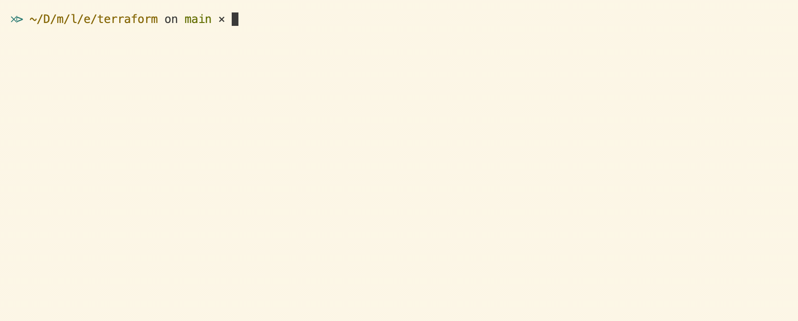

# Lade


Lade (/leɪd/) is a tool allowing you to automatically load secrets from your
preferred vault into environment variables or files. It limits the exposure of
secrets to the time the command requiring the secrets lives.



> Lade is part of the
> [Metatype ecosystem](https://github.com/metatypedev/metatype). Consider
> checking out how this component integrates with the whole ecosystem and browse
> the
> [documentation](https://metatype.dev?utm_source=github&utm_medium=readme&utm_campaign=lade)
> to see more examples.

## Getting started

You can download the binary executable from
[releases page](https://github.com/zifeo/whiz/releases/) on GitHub, make it
executable and add it to your `$PATH` or use the method below to automate those
steps.

```bash
curl -fsSL https://raw.githubusercontent.com/zifeo/lade/main/installer.sh | bash

# via cargo
cargo install lade --locked
cargo install --git https://github.com/zifeo/lade --locked

# upgrade
lade upgrade

# install shell hooks (only required once)
lade install
```

Compatible shells: [Fish](https://fishshell.com),
[Bash](https://www.gnu.org/software/bash/), [Zsh](https://zsh.sourceforge.io)

Compatible vaults: [Infisical](https://infisical.com),
[1Password CLI](https://1password.com/downloads/command-line/),
[Doppler](https://www.doppler.com), [Vault](https://github.com/hashicorp/vault)

## Usage

Lade will run before and after any command you run in your shell thanks to
command hooks installed by `lade install`. On each run, it will recursively look
for `lade.yml` files in the current directory and its parents. It will then
aggregate any secrets matching the command you are running using a regex and
load them into environment variables or files for the time of the run.

```bash
cd examples/terraform
terraform apply
# example = "hello world"
```

See [lade.yml](lade.yml) or the [examples](./examples) folders for other uses
cases.

### Manual injections

In case you prefer to decide when to load secrets, you can manually decide when
to inject them using the `inject` command. Note that when running scripts or a
non-interactive shell session, there is no guarantee that the shell hooks will
be triggered. In that case, the `inject` command is the only way to load
secrets.

```bash
cd examples/terraform
lade inject terraform apply
```

### Outputting as files

By default, Lade will load secrets into environment variables. You can change
this by setting the `.` to the desired file name. The content will be created
based on the extension. Currently, only YAML and JSON are supported.

```yaml
command regex:
  .: file.yml
  ...
```

## Loaders

Most of the vault loaders use their native CLI to operate. This means you must
have them installed locally and your login/credentials must be valid. Lade may
evolve by integrating directly with the corresponding API, but this is left as
future work.

### Infisical loader

```yaml
command regex:
  EXPORTED_ENV_VAR: infisical://DOMAIN/PROJECT_ID/ENV_NAME/SECRET_NAME
```

Frequent domain(s): `app.infisical.com`.

Note: the `/api` is automatically added to the DOMAIN. This source currently
only support a single domain (you cannot be logged into multiple ones).

### 1Password loader

```yaml
command regex:
  EXPORTED_ENV_VAR: op://DOMAIN/VAULT_NAME/SECRET_NAME/FIELD_NAME
```

Frequent domain(s): `my.1password.eu`, `my.1password.com` or `my.1password.ca`.

### Doppler loader

```yaml
command regex:
  EXPORTED_ENV_VAR: doppler://DOMAIN/PROJECT_NAME/ENV_NAME/SECRET_NAME
```

Frequent domain(s): `api.doppler.com`.

### Vault loader

```yaml
command regex:
  EXPORTED_ENV_VAR: vault://DOMAIN/MOUNT/KEY/FIELD
```

### Passbolt loader

```yaml
command regex:
  EXPORTED_ENV_VAR: passbolt://DOMAIN/RESOURCE_ID/FIELD
```

### File loader

Supports INI, JSON, YAML and TOML files.

```yaml
command regex:
  EXPORTED_ENV_VAR: file://PATH?query=.fields[0].field
```

`PATH` can be relative to the lade directory, start with `~`/`$HOME` or absolute
(not recommended when sharing the project with others as they likely have
different paths).

### Raw loader

```yaml
command regex:
  EXPORTED_ENV_VAR: "value"
```

Escaping a value with the `!` prefix enforces the use of the raw loader and
double `!!` escapes itself.

## Development

```bash
eval "$(lade off)"
eval "$(cargo run -- on)"
echo a $A1 $A2 $B1 $B2 $B3 $C1 $C2 $C3
cargo run -- -vvv set echo a
eval "$(cargo run -- off)"
eval "$(lade on)"
```
