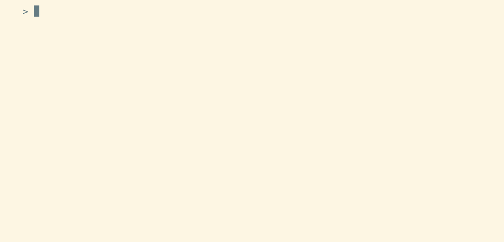
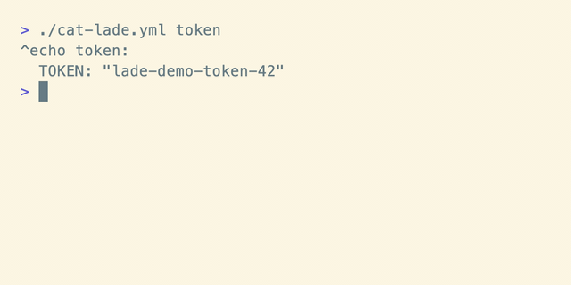
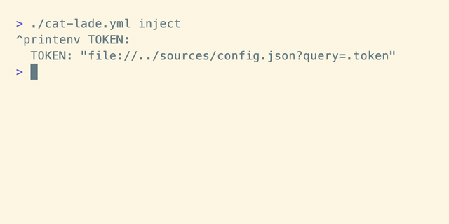
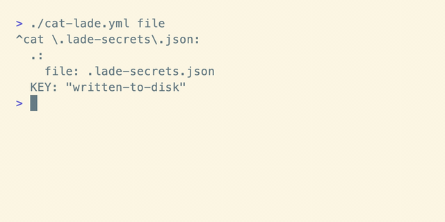
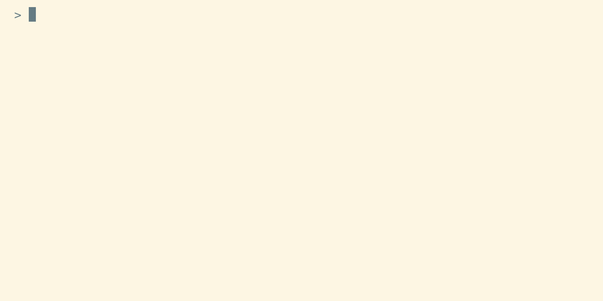
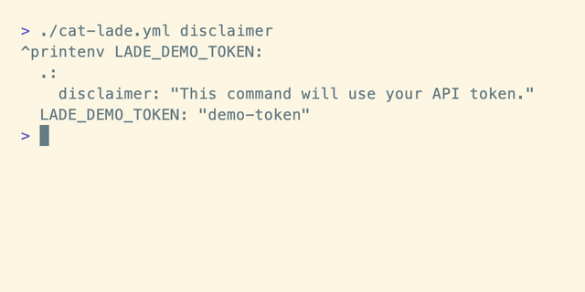
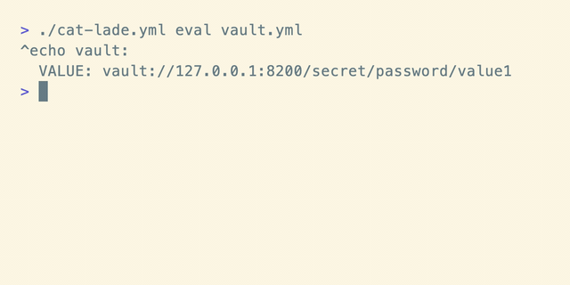

# Lade


Lade (/leɪd/) is a tool allowing you to automatically load secrets from your
preferred vault into environment variables or files. It limits the exposure of
secrets to the time the command requiring the secrets lives.

<p align="center">
  
</p>

> **Using an AI coding agent?** Lade keeps secrets out of the model's context
> window. See [Using Lade with coding agents](#using-lade-with-coding-agents).

## Getting started

You can download the binary executable from
[releases page](https://github.com/zifeo/lade/releases) on GitHub, make it
executable and add it to your `$PATH` or use the method below to automate those
steps.

```bash
# recommended way
curl -fsSL https://raw.githubusercontent.com/zifeo/lade/main/installer.sh | bash

# or alternative ways via cargo
cargo install lade --locked
cargo install --git https://github.com/zifeo/lade --locked

# upgrade
lade upgrade

# install shell hooks (only required once)
lade install
```

Compatible shells: [Fish](https://fishshell.com),
[Bash](https://www.gnu.org/software/bash/), [Zsh](https://zsh.sourceforge.io)

Compatible vaults: [Infisical](https://infisical.com),
[1Password CLI](https://1password.com/downloads/command-line/),
[Doppler](https://www.doppler.com), [Vault](https://github.com/hashicorp/vault),
[Passbolt](https://www.passbolt.com)

## Features

<table>
<tr>
<td width="50%">

**Shell hooks** - Run `lade install` once. Secrets load automatically around every matching command; `lade off` / `lade on` to pause.

</td>
<td width="50%">


</td>
</tr>
<tr>
<td width="50%">

**Provider resolution & command matching** - Load secret values from Infisical, 1Password, Doppler, Vault, Passbolt, the [file provider](#file-provider) (`file://…?query=…`), or inline values, and combine them with network providers in the same rule. Lade merges every `lade.yml` from the current directory up to the repo root. Each block is a regex on the command you run.

</td>
<td width="50%">



</td>
</tr>
<tr>
<td width="50%">

**Manual injection & redaction** - `lade <command>` is the shortcut for one-shot injection when hooks are off or in scripts (explicit form: `lade inject <command>`). Unless `--no-mask` is set, values fetched from secret providers are masked in stdout/stderr as `${VAR_NAME:-REDACTED}`. The [raw provider](#raw-provider) values are not (already plaintext in `lade.yml`).

</td>
<td width="50%">



</td>
</tr>
<tr>
<td width="50%">

**Secrets as files** - `file:` under `.` writes JSON/YAML for the command; Lade removes the file when the command exits.

</td>
<td width="50%">



</td>
</tr>
<tr>
<td width="50%">

**Per-user secrets** - Map usernames to different values; `lade user` selects who you are (`"."` is the default).

</td>
<td width="50%">



</td>
</tr>
<tr>
<td width="50%">

**Disclaimer** - Optional `disclaimer:` on a rule; type `yes` before secrets load. In hook mode, consent with `lade approve <code>` (the code is shown in the disclaimer).

</td>
<td width="50%">



</td>
</tr>
<tr>
<td width="50%">

**`lade eval`** - Resolve one URI and print the value (uses the same providers as `lade.yml`).

</td>
<td width="50%">



</td>
</tr>
<tr>
<td width="50%">

**Shell command provider** - Execute any command and use its stdout as a secret. Supports `sh://`, `bash://`, `zsh://`, and `fish://`.

</td>
<td width="50%">


</td>
</tr>
</table>

## Usage

See [lade.yml](lade.yml) or [examples/tape/lade.yml](examples/tape/lade.yml) for
configuration samples. Network provider demo transcript:
[examples/tape/network.txt](examples/tape/network.txt).

### Per-user secrets

```yaml
command regex:
  SAME_SECRET_FOR_EVERYONE: hello_world
  SECRET_FOR_THE_USER:
    alex: alex_secret
    zifeo: zifeo_secret
    .: default_secret
```

```sh
lade user              # show currently set user
lade user tonystark    # set user to tonystark
lade user --reset      # reset, falling back to the OS user
```

### Outputting as files & interactive disclaimer

Both options live under `.` on a rule.

```yaml
command regex:
  .:
    file: secrets.yml
    disclaimer: "This command will use your API token."
  SECRET: op://...
```

When using shell hooks, disclaimers cannot prompt for input. Instead, Lade withholds secrets and prints a per-command approval code; review the disclaimer and run `lade approve <code>` to execute the command, or re-run it prefixed with `LADE_APPROVE=<code>`.

## Providers

Lade has two first-class provider families used from the same `lade.yml` rule:

- Secret providers resolve values/files into environment variables.
- Network providers create command-scoped connectivity and clean up automatically.

```yaml
"psql .*":
  # secret provider
  DB_USER: op://my.1password.com/eng/postgres/username
  # network provider (dynamic local port injected into DB_PORT)
  DB_PORT: kubectl://k8s.example.com:6443/claryo-gcp-01/dev/service/postgres/5432
  DATABASE_URL: postgres://${DB_USER}@127.0.0.1:${DB_PORT}/app
```

### Secret providers

Most secret providers use their native CLI. Ensure required binaries are
installed and authenticated before running commands.

### Infisical provider

```yaml
command regex:
  EXPORTED_ENV_VAR: infisical://DOMAIN/PROJECT_ID/ENV_NAME/SECRET_NAME
```

Frequent domain(s): `app.infisical.com`.

Note: the `/api` is automatically added to the DOMAIN. This source currently
only support a single domain (you cannot be logged into multiple ones).

### 1Password provider

```yaml
command regex:
  EXPORTED_ENV_VAR: op://DOMAIN/VAULT_NAME/SECRET_NAME/FIELD_NAME
```

Frequent domain(s): `my.1password.eu`, `my.1password.com` or `my.1password.ca`.

In CI/CD `OP_SERVICE_ACCOUNT_TOKEN` is typically injected directly by the
platform. For cases where the token itself is stored in another vault, add
`1password_service_account` to the `.` config block. Lade resolves that URI
first - using any provider - and injects the result as `OP_SERVICE_ACCOUNT_TOKEN`
before resolving the remaining `op://` secrets. This enables recursive
cross-vault lookups: the token lives in Vault or Infisical, and the actual
secrets live in 1Password.

Per-user mapping lets each developer or environment use a different source for
the token, or skip it entirely with `null` to fall back on their local `op` session.

```yaml
command regex:
  .:
    # simple: token stored in 1Password itself (requires an active op session)
    1password_service_account: op://DOMAIN/VAULT/ITEM/FIELD
    # or per-user: CI pulls token from Vault, others use their local op session
    # 1password_service_account:
    #   ci: vault://DOMAIN/MOUNT/KEY/FIELD
  EXPORTED_ENV_VAR: op://...
```

### Doppler provider

```yaml
command regex:
  EXPORTED_ENV_VAR: doppler://DOMAIN/PROJECT_NAME/ENV_NAME/SECRET_NAME
```

Frequent domain(s): `api.doppler.com`.

### Vault provider

```yaml
command regex:
  EXPORTED_ENV_VAR: vault://DOMAIN/MOUNT/KEY/FIELD
```

### Passbolt provider

```yaml
command regex:
  EXPORTED_ENV_VAR: passbolt://DOMAIN/RESOURCE_ID/FIELD
```

### Shell command provider

Executes a command and uses its stdout as the secret value. Supports `sh://`, `bash://`, `zsh://`, and `fish://`.

```yaml
command regex:
  EXPORTED_ENV_VAR: sh://gcloud auth print-access-token
```

### File provider

Supports INI, JSON, YAML and TOML files.

```yaml
command regex:
  EXPORTED_ENV_VAR: file://PATH?query=.fields[0].field
```

`PATH` can be relative to the lade directory, start with `~`/`$HOME` or absolute
(not recommended when sharing the project with others as they likely have
different paths).

### Raw provider

```yaml
command regex:
  EXPORTED_ENV_VAR: "value"
```

Escaping a value with the `!` prefix enforces the use of the raw provider and
double `!!` escapes itself.

### Network providers

Network providers acquire temporary local forwards for the command lifecycle.

```yaml
"psql .*":
  # fixed local port
  1223: kubectl://k8s.example.com:6443/claryo-gcp-01/dev/service/postgres/5432
  # dynamic local port in env
  DB_PORT: kubectl://k8s.example.com:6443/claryo-gcp-01/dev/service/postgres/5432
```

Per-user overrides use the same shape as secret providers:

```yaml
"psql .*":
  DB_PORT:
    alice: kubectl://k8s-a.example.com:6443/claryo-az-02/dev/service/postgres/5432
    ".": kubectl://k8s-b.example.com:6443/claryo-gcp-01/dev/service/postgres/5432
```

#### kubectl provider

URI format:

- `kubectl://<cluster-host>:<cluster-port>/<context-selector>/<namespace>/<kind>/<name>/<remote-port>`

Query options:

- `local=HOST:PORT`
- `pod-running-timeout=<duration>`

#### kubefwd provider

URI format:

- `kubefwd://<cluster-host>:<cluster-port>/<context-selector>/<namespace>/<kind>/<name>/<service-port>`

Query options:

- `local=HOST:PORT`
- `domain=<domain>`
- `selector=<selector>`

#### tsh provider

URI format:

- `tsh://<proxy-host>:<proxy-port>/<kube-cluster>/<namespace>/<kind>/<name>/<remote-port>`

Query options:

- `local=HOST:PORT`

#### ssh provider

URI format:

- `ssh://<jump-host>:<jump-port>/<remote-host>/<remote-port>`

Query options:

- `local=HOST:PORT`

## Using Lade with coding agents

Lade is an interceptor, not a data source, so its best agentic story is
_transparency_: keep secrets out of the model's context window rather than
teaching the agent a procedure. The right integration depends on whether your
agent supports `preToolUse` shell hooks.

Cursor agents can also load the concise project skill in
[`.cursor/skills/lade/SKILL.md`](.cursor/skills/lade/SKILL.md).

```
Does your agent support preToolUse / PreToolUse shell hooks?
├─ Yes  (Cursor, Claude Code)
│        → install .cursor/hooks.json / .claude/settings.json (below).
│          Lade transparently rewrites matching commands into `lade inject`,
│          and redacts secrets from the output so they never enter the
│          agent's context window or chat transcript.
└─ No   (Gemini CLI, Codex, Copilot CLI, …)
         → tell the agent, via AGENTS.md, to prefix matching commands with
           `lade` (e.g. `lade terraform apply`).
```

### Recommended: preToolUse hooks (transparent)

When the agent runs a shell command, Lade inspects it and — if it matches a
`lade.yml` rule — rewrites it into `lade inject '<command>'`. The agent never
sees the secret values: `lade inject` masks provider-resolved values in
stdout/stderr as `${VAR:-REDACTED}`, so **secrets stay out of the model's
context window and the chat transcript**. Invoking `lade hook` means an AI agent
is driving by construction, so no environment detection is needed.

```bash
lade hook  # reads the tool-call JSON from stdin, writes the platform response to stdout
```

`lade install` detects the agents present on your machine (a `~/.cursor` or
`~/.claude` directory) and offers to add the hook to their global config for
you; `lade uninstall` removes it again. The JSON below is the equivalent manual
setup (e.g. for a project-local `.cursor/hooks.json` / `.claude/settings.json`).

#### Cursor

[Docs](https://cursor.com/docs/agent/hooks). `.cursor/hooks.json`:

```json
{
  "version": 1,
  "hooks": { "preToolUse": [{ "command": "lade hook", "matcher": "Shell" }] }
}
```

#### Claude Code

[Docs](https://code.claude.com/docs/en/hooks). `.claude/settings.json`:

```json
{
  "hooks": {
    "PreToolUse": [
      {
        "matcher": "Bash",
        "hooks": [{ "type": "command", "command": "lade hook" }]
      }
    ]
  }
}
```

### Fallback: agents without hooks

Gemini CLI, Codex, and Copilot CLI have no `preToolUse` mechanism. Instruct them
— via an `AGENTS.md` at the repo root — to prefix the commands that need secrets
with `lade`:

```
When a command needs secrets defined in `lade.yml`, prefix it with `lade`
(e.g. `lade terraform apply`). Lade injects the secrets and redacts them
from the command output.
```

This is the fallback, not the default: the agent has to guess which commands
match the `lade.yml` regexes, knowledge that lives in `lade.yml` rather than the
model. The hook removes that burden entirely.

When a matched rule carries a `disclaimer:`, Lade never silently injects
secrets: it fails closed and prints a per-command approval code that the human
must copy (`LADE_APPROVE=<code>`), so an agent cannot self-approve with a fixed
reflex. The machine-readable `lade status --json` output, stable exit codes, and
how Lade detects an agent are documented in
[the architecture notes](docs/architecture.md#5-agents-lade-hook--the-direct-path).

## Continuous integration & containers

The installer runs non-interactively in CI (when `CI=1`, `ASSUME_YES=1`, or
stdin is not a TTY) and verifies the published SHA256 checksum
(`<asset>.sha256`): a mismatch aborts, a missing checksum warns and continues.

### One-liners

```bash
# curl
curl -fsSL https://raw.githubusercontent.com/zifeo/lade/main/installer.sh | CI=1 bash

# wget
wget -qO- https://raw.githubusercontent.com/zifeo/lade/main/installer.sh | CI=1 bash
```

Pin a version with `VERSION=x.y.z`; force the downloader with
`DOWNLOADER=curl|wget`:

```bash
curl -fsSL https://raw.githubusercontent.com/zifeo/lade/main/installer.sh | CI=1 VERSION=0.15.1 bash
```

### GitHub Actions

```yaml
steps:
  - uses: zifeo/lade@v0.15.1 # pin to a release tag
    with:
      version: "0.15.1" # lade version to install (default: "latest")
      # out-dir: ${{ github.workspace }}/.lade-bin  # added to PATH
  - run: lade inject -- terraform apply
    env:
      OP_SERVICE_ACCOUNT_TOKEN: ${{ secrets.OP_SERVICE_ACCOUNT_TOKEN }}
```

### GitLab CI

```yaml
deploy:
  script:
    - curl -fsSL https://raw.githubusercontent.com/zifeo/lade/main/installer.sh | CI=1 VERSION=0.15.1 bash
    - lade inject -- terraform apply
```

### Docker

Compose the static musl binary onto your own image — no build toolchain
required:

```dockerfile
COPY --from=ghcr.io/zifeo/lade:0.15.1 /usr/local/bin/lade /usr/local/bin/lade
```

The `ghcr.io/zifeo/lade` image is published for `linux/amd64` and `linux/arm64`
with tags `X.Y.Z`, `X.Y`, and `latest`. Pin an exact `X.Y.Z` for reproducible
builds.

## Development

```bash
eval "$(lade off)"
eval "$(cargo run -- on)"
echo a $A1 $A2 $B1 $B2 $B3 $C1 $C2 $C3
cargo run -- -vvv set echo a
cargo run -- inject echo a
eval "$(cargo run -- off)"
eval "$(lade on)"
```
