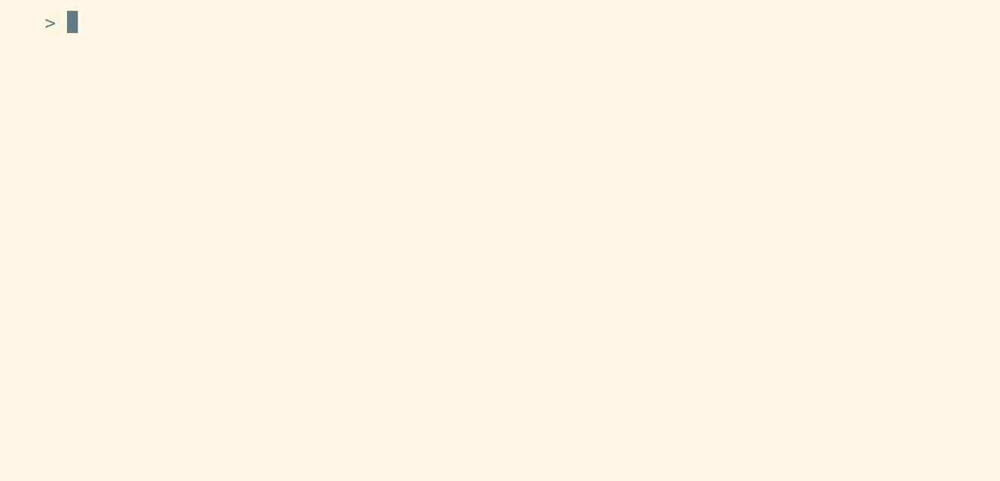

# Lade


Give shell commands and AI agents temporary access to secrets, files, and
private networks, then clean everything up automatically.

<p align="center">
  
</p>

Lade (/leɪd/) matches the command you run, loads only what it needs, masks
provider-resolved secrets from command output, and removes command-scoped files
and network forwards when the process exits.

## Why Lade?

Modern commands need short-lived access: a deploy needs tokens, a migration needs
a private database, an AI agent needs to run a tool without seeing the secrets
behind it. Lade keeps that access scoped to the command instead of your whole
shell session, CI job, or model context.

- Load secrets from [1Password CLI](https://1password.com/downloads/command-line/),
  [Infisical](https://infisical.com), [Doppler](https://www.doppler.com),
  [Vault](https://github.com/hashicorp/vault),
  [Passbolt](https://www.passbolt.com), local files, shell commands, or inline
  values.
- Write temporary JSON/YAML files for tools that expect credentials on disk.
- Open private network access through `kubectl`, `kubefwd`, Teleport `tsh`, or
  SSH only while the command runs.
- Redact provider-resolved secrets from stdout and stderr.
- Work from shells, CI, Cursor, and Claude Code.

Compatible shells: [Fish](https://fishshell.com),
[Bash](https://www.gnu.org/software/bash/), [Zsh](https://zsh.sourceforge.io).
Lade targets Unix systems: macOS and Linux.

## Getting started

```bash
curl -fsSL https://raw.githubusercontent.com/zifeo/lade/main/installer.sh | bash
lade install
```

`lade install` adds preexec shell hooks once. After that, matching commands are wrapped
automatically. Pause and resume them with `lade off` and `lade on`.

Alternative installs:

```bash
cargo install lade --locked
cargo install --git https://github.com/zifeo/lade --locked
```

Upgrade with:

```bash
lade upgrade
```

## How it works

Create a `lade.yml` at your project root. Each top-level key is a regular
expression matched against the command being run.

```yaml
"psql .*":
  DB_USER: op://my.1password.com/eng/postgres/username
  DB_PORT: kubectl://k8s.example.com:6443/prod/default/service/postgres/5432
  DATABASE_URL: postgres://${DB_USER}@127.0.0.1:${DB_PORT}/app
```

Now run the command normally:

```bash
psql "$DATABASE_URL"
```

Lade resolves `DB_USER`, opens a local forward for `DB_PORT`, interpolates both
into `DATABASE_URL`, runs the command, masks resolved secret values from output,
and cleans up when `psql` exits.

Preexec shell hooks are the recommended path because you keep typing normal commands.
When they are unavailable, prefix the command with `lade` for one-shot
injection. The explicit form is `lade inject <command>`.

```bash
lade terraform apply
lade inject -- terraform apply
```

## Common patterns

<table>
<tr>
<td width="50%">

**preexec shell hooks** - Run commands normally. Lade injects access only when the
command matches `lade.yml`.

</td>
<td width="50%">


</td>
</tr>
<tr>
<td width="50%">

**Provider resolution** - Match commands and load values from vaults, files, or
inline config only when needed.

</td>
<td width="50%">


</td>
</tr>
<tr>
<td width="50%">

**Manual injection** - Use `lade <command>` in scripts, CI, or shells without
hooks. The explicit form is `lade inject <command>`.

</td>
<td width="50%">


</td>
</tr>
<tr>
<td width="50%">

**Private networks** - Open a local forward only while the command runs, then
close it automatically.

</td>
<td width="50%">


</td>
</tr>
<tr>
<td width="50%">

**Secrets as files** - Write temporary config files for commands that expect
credentials on disk.

</td>
<td width="50%">


</td>
</tr>
<tr>
<td width="50%">

**Per-user values** - Keep one shared `lade.yml` while developers, CI, and
environments resolve different values.

</td>
<td width="50%">


</td>
</tr>
<tr>
<td width="50%">

**Human approval** - Add a disclaimer before sensitive commands. Hooks withhold
access until the approval code is used.

</td>
<td width="50%">


</td>
</tr>
<tr>
<td width="50%">

**Shell command provider** - Use stdout from a local command as a secret value.

</td>
<td width="50%">


</td>
</tr>
<tr>
<td width="50%">

**Intermediate bindings** - Compose a public value from a private binding
without injecting the private value itself.

</td>
<td width="50%">


</td>
</tr>
</table>

## AI agents

AI coding agents often need to run commands that require secrets, private
network access, or both. Lade lets the command access what it needs without
putting secret values in the model context or chat transcript.

### Recommended usage: preTool hooks

Cursor and Claude Code can call `lade hook` before shell commands. When an agent
runs a matching command, Lade rewrites it through `lade inject`, resolves the
configured access, and redacts provider-resolved secret values from stdout and
stderr.

The agent keeps using normal commands. Lade handles the sensitive part.

`lade install` can add the hook for detected agents. The equivalent project
configs are:

#### Cursor

```json
{
  "version": 1,
  "hooks": { "preToolUse": [{ "command": "lade hook", "matcher": "Shell" }] }
}
```

#### Claude Code

```json
{
  "hooks": {
    "PreToolUse": [
      {
        "matcher": "Bash",
        "hooks": [{ "type": "command", "command": "lade hook" }]
      }
    ]
  }
}
```

Cursor agents can also load the project skill in
[.agents/skills/lade/SKILL.md](.agents/skills/lade/SKILL.md).

### Agents without preTool hooks

For agents without shell hooks, add a short instruction to `AGENTS.md`:

```text
When a command needs access defined in lade.yml, prefix it with lade.
Example: lade terraform apply
```

Transparent hooks are preferred because the agent does not need to guess which
commands match `lade.yml`.

## MCP

Desktop MCP clients normally launch a server without the shell environment
where a secret manager is available. Putting long-lived credentials directly in
the client configuration is inconvenient and exposes them to every process
launched from that app. `lade mcp` makes the client launch Lade instead: it
resolves the matching access only for that MCP connection, then exits and
cleans up when the connection closes.

Add a server entry in your MCP client's configuration. Use the absolute path to
the installed `lade` binary when a GUI application does not inherit your shell
`PATH`.

For a local stdio server, all public mappings become child environment
variables:

```json
{
  "command": "lade",
  "args": ["mcp", "--", "acme-mcp", "--stdio"]
}
```

Match the canonical server command in `lade.yml`:

```yaml
"^acme-mcp --stdio$":
  API_TOKEN: op://company/acme/api-token
```

For a remote Streamable HTTP server, public mapping keys become HTTP header
names. The URL itself is the matcher:

```yaml
"^https://mcp\\.secureframe\\.com/$":
  .API_KEY: op://company/secureframe/api-key
  .API_SECRET: op://company/secureframe/api-secret
  Authorization: "${API_KEY} ${API_SECRET}"
```

```json
{
  "command": "lade",
  "args": ["mcp", "https://mcp.secureframe.com/"]
}
```

Keys prefixed with `.` are intermediate variables. They can be referenced with
`$NAME`, `${NAME}`, or `${.NAME}`, participate in secret masking, and are never emitted to the child
environment, temporary file, or HTTP headers. `.` on its own remains the rule
configuration block. A public key and `.KEY` cannot be declared together.

Intermediate variables belong to binding resolution, not MCP: they work with
shell hooks, `lade inject`, file output, and MCP. For example, only the
composed value is injected:

```yaml
"deploy .*":
  .TOKEN: op://company/production/deploy/token
  DEPLOY_AUTHORIZATION: "Bearer ${TOKEN}"
```

```bash
lade inject -- deploy production
```

The child receives `DEPLOY_AUTHORIZATION`, never `TOKEN`.

To troubleshoot an MCP connection, add `-v` before `mcp` in the client
configuration arguments. Lade writes action-only traces to stderr, such as
`mcp http -> tools/call` and `mcp http <- 200 (42 ms)`. It never logs headers,
JSON-RPC parameters, request bodies, or resolved values. Use `-vv` for debug
logs; `LADE_LOG` overrides the command-line verbosity.

## Configuration reference

Lade has two provider families used from the same `lade.yml` rule:

- Secret providers resolve values into environment variables or temporary files.
- Network providers create command-scoped connectivity and clean up
  automatically.

### Secrets

```yaml
"terraform .*":
  TF_VAR_api_key: op://DOMAIN/VAULT/ITEM/FIELD
```

Most secret providers use their native CLI. Ensure the required binaries are
installed and authenticated before running commands. Provider-resolved values
are masked from command output unless `--no-mask` is set. Inline values are not
masked because they are already visible in `lade.yml`.

Supported secret providers:

| Provider      | URI                                                  | Notes                                               |
| ------------- | ---------------------------------------------------- | --------------------------------------------------- |
| 1Password     | `op://DOMAIN/VAULT/ITEM/FIELD`                       | Uses the 1Password CLI.                             |
| Infisical     | `infisical://DOMAIN/PROJECT_ID/ENV_NAME/SECRET_NAME` | The `/api` suffix is added automatically.           |
| Doppler       | `doppler://DOMAIN/PROJECT_NAME/ENV_NAME/SECRET_NAME` | Uses the Doppler CLI.                               |
| Vault         | `vault://DOMAIN/MOUNT/KEY/FIELD`                     | Uses the Vault CLI.                                 |
| Passbolt      | `passbolt://DOMAIN/RESOURCE_ID/FIELD`                | Uses the Passbolt CLI.                              |
| File          | `file://PATH?query=.fields[0].field`                 | Supports INI, JSON, YAML, and TOML files.           |
| Shell command | `sh://gcloud auth print-access-token`                | Also supports `bash://`, `zsh://`, and `fish://`.   |
| Inline value  | `"visible-in-lade-yml"`                              | Use `!` to force raw values and `!!` to escape `!`. |

Use `lade eval <uri>` to resolve one URI when debugging a provider.

### Intermediate bindings

Use a `.NAME` binding when a resolved value only helps construct another
binding. It remains private to the one command invocation, while the public
binding is injected into the requested output:

```yaml
"curl .*api\\.example\\.com.*":
  .API_KEY: op://company/api/key
  Authorization: "Bearer ${API_KEY}"
```

Here `Authorization` is injected; `API_KEY` is not. Private bindings can depend
on other bindings and are included in masking when their resolved values reach
a public value. The end-to-end terminal demo is
[examples/tape/intermediate.exp](examples/tape/intermediate.exp).

### Shell transforms

`sh://`, `bash://`, `zsh://`, and `fish://` sources can derive a value with the
shell. Lade recognizes simple `$NAME` and `${NAME}` references to build the
dependency graph, then passes their resolved values as environment variables to
the shell without rewriting the script. The shell remains responsible for all
other expansion syntax.

```yaml
"curl .*api\\.example\\.com.*":
  user: demo-user
  .password: op://company/api/password
  Authorization: 'sh://printf "Basic %s" "$(printf "%s:%s" "${user}" "$password" | base64 | tr -d "\n")"'
```

Quote shell variable expansions (`"$user"`, `"$password"`) so their values are
passed as single arguments. The shell provider output is treated as secret and
is masked like other provider-resolved values.

### Files and disclaimers

Options under `.` configure the matched command itself.

```yaml
"deploy .*":
  .:
    file: secrets.yml
    disclaimer: "This command will use production credentials."
  API_TOKEN: op://DOMAIN/VAULT/ITEM/FIELD
```

`when` is `always` (default), `human`, or `agent`. Audience comes from
`detect()`: `LADE_VIA=pretool` or `lade hook` is `agent`; `LADE_VIA=preexec` or
`lade set`/`unset` is `human`; otherwise env signals (`AI_AGENT`, `CURSOR_AGENT`,
`CLAUDECODE`, not `CURSOR_VERSION`) select `agent`, else `human`. The same
pattern can be a YAML list of these blocks when `when` differs. `silence` is
optional and skips that rule's secret progress lines at hydration.

```yaml
"^git ":
  - .:
      when: human
    SSH_AUTH_SOCK: sh://launchctl getenv SSH_AUTH_SOCK
  - .:
      when: agent
    SSH_AUTH_SOCK: 'sh://printf %s "$HOME/.ssh/agent.sock"'
```

With hooks, disclaimers cannot prompt for input. Lade withholds access and
prints an approval code; review it, then run `lade approve <code>` or re-run the
command with `LADE_APPROVE=<code>`.

### Per-user values

```yaml
"deploy .*":
  API_TOKEN:
    alice: op://DOMAIN/VAULT/ALICE_TOKEN/FIELD
    ci: vault://DOMAIN/MOUNT/ci-token/value
    .: op://DOMAIN/VAULT/DEFAULT_TOKEN/FIELD
```

```bash
lade user
lade user alice
lade user --reset
```

### Networks

Network providers acquire temporary local forwards for the command lifecycle.
Assign a URI to an environment variable for a dynamic local port, or to a number
for a fixed local port.

```yaml
"psql .*":
  DB_PORT: kubectl://k8s.example.com:6443/prod/default/service/postgres/5432
  1223: ssh://jump.example.com:22/db.internal/5432
```

Supported network providers:

| Provider  | URI                                                                                                   | Query options                                               |
| --------- | ----------------------------------------------------------------------------------------------------- | ----------------------------------------------------------- |
| `kubectl` | `kubectl://<cluster-host>:<cluster-port>/<context-selector>/<namespace>/<kind>/<name>/<remote-port>`  | `local=HOST:PORT`, `pod-running-timeout=<duration>`         |
| `kubefwd` | `kubefwd://<cluster-host>:<cluster-port>/<context-selector>/<namespace>/<kind>/<name>/<service-port>` | `local=HOST:PORT`, `domain=<domain>`, `selector=<selector>` |
| `tsh`     | `tsh://<proxy-host>:<proxy-port>/<kind>/<resource-path>`                                              | `local=HOST:PORT`                                           |
| `ssh`     | `ssh://<jump-host>:<jump-port>/<remote-host>/<remote-port>`                                           | `local=HOST:PORT`                                           |

For `tsh`, `<kind>` uses Teleport resource nomenclature:

- `app/<app-name>[/<target-port>]`
- `kube_cluster/<kube-cluster>/<namespace>/<resource-kind>/<name>/<remote-port>`

See [examples/tape/lade.yml](examples/tape/lade.yml) and
[examples/tape/network.txt](examples/tape/network.txt) for more examples.

<details>
<summary>1Password service account tokens</summary>

In CI, `OP_SERVICE_ACCOUNT_TOKEN` is usually injected directly by the platform.
If the token itself lives in another vault, add `1password_service_account` to
the `.` block. Lade resolves that URI first and uses it while resolving
remaining `op://` secrets.

```yaml
"deploy .*":
  .:
    1password_service_account: vault://DOMAIN/MOUNT/KEY/FIELD
  API_TOKEN: op://DOMAIN/VAULT/ITEM/FIELD
```

</details>

## CI and containers

The installer runs non-interactively in CI when `CI=1`, `ASSUME_YES=1`, or stdin
is not a TTY.

```bash
curl -fsSL https://raw.githubusercontent.com/zifeo/lade/main/installer.sh | CI=1 bash
```

### GitHub Actions

```yaml
steps:
  - uses: zifeo/lade@v0.15.3
    with:
      version: "0.15.3"
  - run: lade inject -- terraform apply
    env:
      OP_SERVICE_ACCOUNT_TOKEN: ${{ secrets.OP_SERVICE_ACCOUNT_TOKEN }}
```

### GitLab CI

```yaml
deploy:
  script:
    - curl -fsSL https://raw.githubusercontent.com/zifeo/lade/main/installer.sh | CI=1 VERSION=0.15.3 bash
    - lade inject -- terraform apply
```

### Docker

```dockerfile
COPY --from=ghcr.io/zifeo/lade:0.15.3 /usr/local/bin/lade /usr/local/bin/lade
```

The `ghcr.io/zifeo/lade` image is published for `linux/amd64` and `linux/arm64`
with tags `X.Y.Z`, `X.Y`, and `latest`. Pin an exact `X.Y.Z` for reproducible
builds.

## Development

```bash
eval "$(lade off)"
eval "$(cargo run -- on)"
echo a $A1 $A2 $B1 $B2 $B3 $C1 $C2 $C3
cargo run -- -vvv set echo a
cargo run -- inject echo a
eval "$(cargo run -- off)"
eval "$(lade on)"
```
