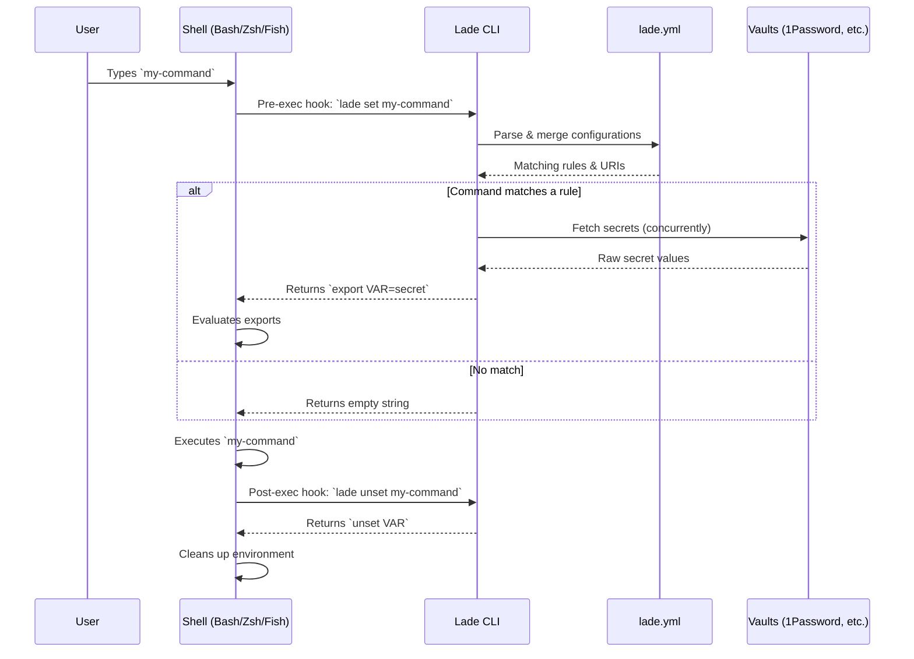
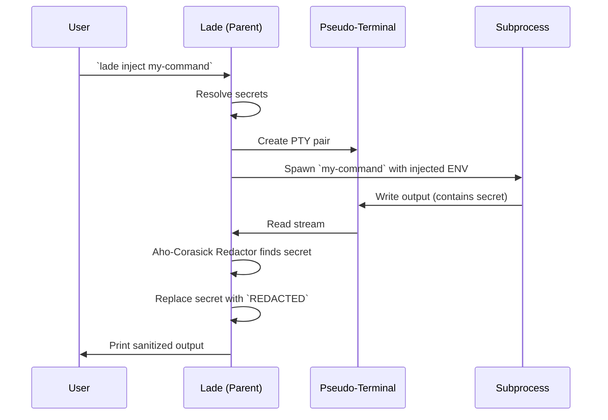

# Lade Architecture

This document provides an overview of Lade's internal architecture, explaining how commands are intercepted, how configurations are resolved, and how secrets are securely injected and masked.

## 1. High-Level Flow (Shell Hooks)

When a user runs `lade on`, Lade registers a pre-execution hook in their shell (Bash, Zsh, or Fish). This hook intercepts commands before they are run to check if they require secrets.



## 2. Configuration Resolution

Lade traverses the directory tree upwards to find and merge all `lade.yml` files. It then evaluates the rules against the current command.

```mermaid
flowchart TD
    Start[Command: `npm run build`] --> Find[Find all `lade.yml` from CWD to Git Root]
    Find --> Merge[Merge configs (deep merge)]
    Merge --> Match{Regex matches command?}
    
    Match -- Yes --> UserCheck{Is user specified?}
    UserCheck -- Yes --> ResolveUser[Resolve for specific user or fallback to `.']
    UserCheck -- No --> ResolveUser
    
    ResolveUser --> Loaders[Dispatch to Loaders]
    
    Match -- No --> Skip[Skip rule]
    
    Loaders --> |op://| OpLoader[1Password CLI]
    Loaders --> |vault://| VaultLoader[HashiCorp Vault]
    Loaders --> |file://| FileLoader[Local File]
    Loaders --> |Raw| RawLoader[Plaintext]
```

## 3. Execution & Masking (`lade inject`)

When using `lade inject` (or in environments where shell hooks aren't available), Lade wraps the command execution. It uses a pseudo-terminal (PTY) to capture the output and redact secrets on the fly.


