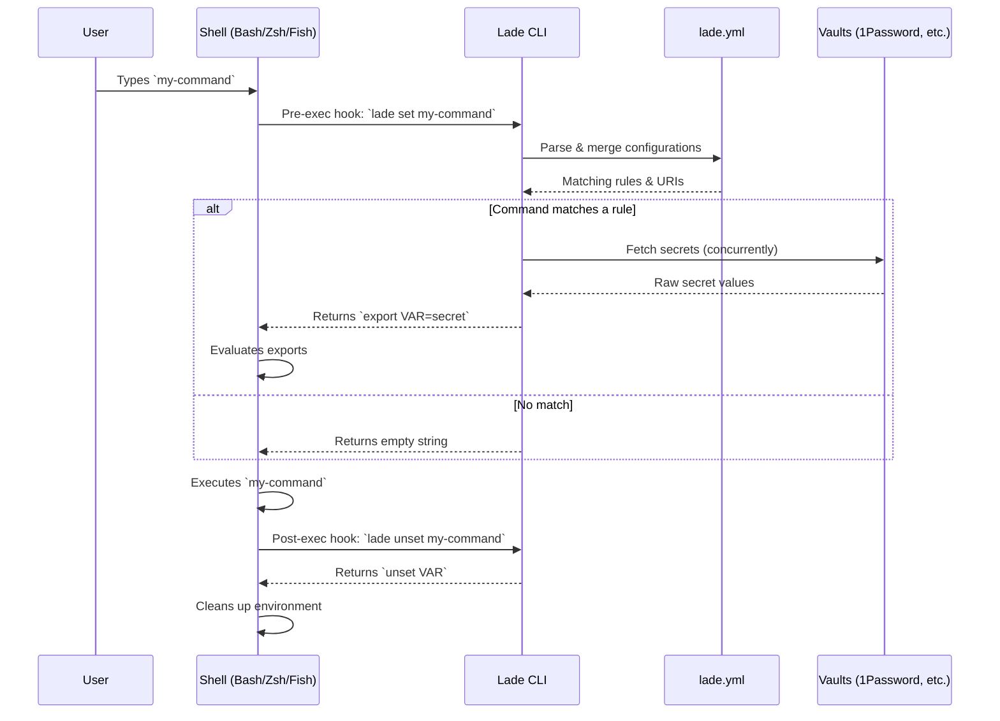
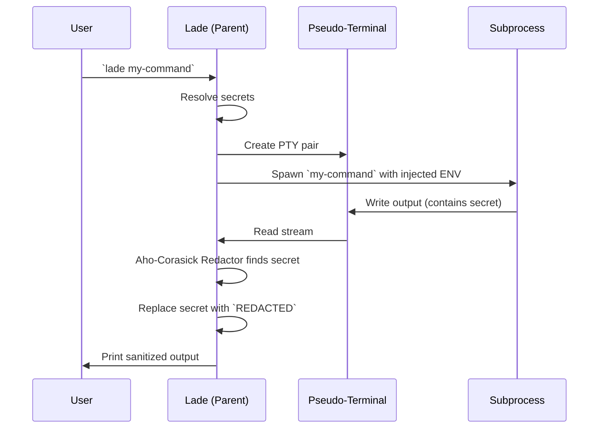
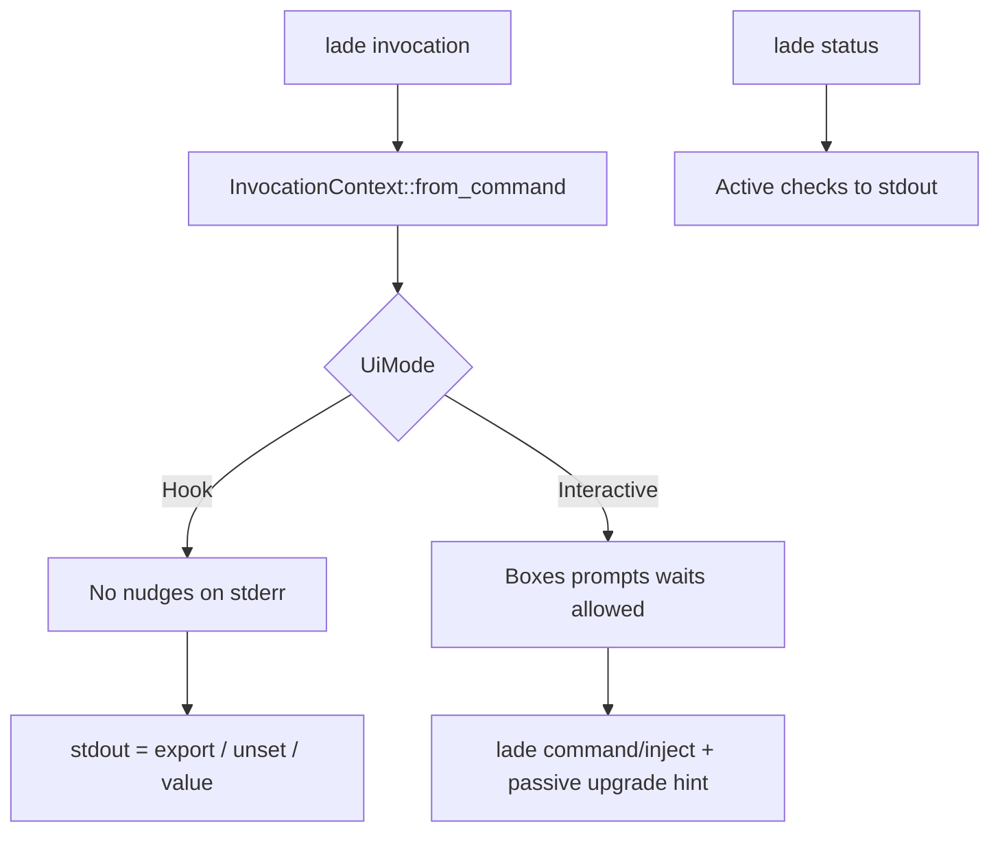

# Lade Architecture

This document provides an overview of Lade's internal architecture, explaining how commands are intercepted, how configurations are resolved, and how secrets are securely injected and masked.

## 1. High-Level Flow (Shell Hooks)

When a user runs `lade on`, Lade registers a pre-execution hook in their shell (Bash, Zsh, or Fish). This hook intercepts commands before they are run to check if they require secrets.



## 2. Configuration Resolution

Lade traverses the directory tree upwards to find and merge all `lade.yml` files. It then evaluates the rules against the current command.

```mermaid
flowchart TD
    Start[Command: `npm run build`] --> Find[Find all `lade.yml` from CWD to Git Root]
    Find --> Merge[Merge configs (deep merge)]
    Merge --> Match{Regex matches command?}

    Match -- Yes --> UserCheck{Is user specified?}
    UserCheck -- Yes --> ResolveUser[Resolve for specific user or fallback to `.']
    UserCheck -- No --> ResolveUser

    ResolveUser --> Loaders[Dispatch to Loaders]

    Match -- No --> Skip[Skip rule]

    Loaders --> |op://| OpLoader[1Password CLI]
    Loaders --> |vault://| VaultLoader[HashiCorp Vault]
    Loaders --> |file://| FileLoader[Local File]
    Loaders --> |Raw| RawLoader[Plaintext]
```

## 3. Execution & Masking (`lade <command>` / `lade inject <command>`)

When using the top-level shortcut `lade <command>` (or the explicit form `lade inject <command>`, or in environments where shell hooks aren't available), Lade wraps the command execution. It uses a pseudo-terminal (PTY) to capture the output and redact secrets on the fly.



## 4. UI policy (Hook vs Interactive)

Shell hooks call `lade set` / `lade unset` inside **preexec/postexec**. At that moment the shell still owns the TTY: input echo and line editing are unreliable (see [fish-shell#8484](https://github.com/fish-shell/fish-shell/issues/8484)). Lade therefore treats hook invocations as **Hook** mode: no nudges, no prompts, no timed waits on stderr. stdout remains the shell protocol (`export` / `unset`).

**Interactive** mode applies only to injected execution (`lade <command>` or `lade inject <command>`) when **both** stdin and stderr are TTYs. That is the path where disclaimers, provider warnings, compat notices, upgrade reminders, and `Lade loaded` may appear.



| Surface | Hook | Interactive |
|---------|------|-------------|
| Disclaimer prompt | fail closed (exit 1) + `LADE_PENDING` | box + type `yes` |
| Provider warnings + 5s wait | silent | box + wait |
| `Lade loaded` | silent | eprintln |
| Compat CLI warning | silent | passive box + auto snooze |
| Upgrade reminder | silent | passive info box after inject |
| Loader error | one-line stderr + exit 1 | error box + wait + exit 1 |

Secret resolution (`hydrate_secrets`) is UI-free. Presentation (`prepare_secrets`) applies the policy above.

### Disclaimer Flow

Interactive prompts are forbidden in hook mode due to shell limitations (stdin hijacking, lack of echo). When a command matches a rule with a `disclaimer:`, the hook flow behaves as follows:

1. **`lade set`** (preexec) detects the disclaimer.
2. It outputs `unset LADE_PENDING` to clear any stale state.
3. It outputs `export LADE_PENDING=v1:...` (base64url JSON of cmd and cwd).
4. It prints the disclaimer text in a **Warning MessageBox** to stderr and exits with code 1.
5. The user's command runs **without secrets** (fail-closed).
6. To proceed, the user runs **`lade approve`**.
7. `lade approve` reads `LADE_PENDING`, and executes the command (equivalent to injected execution via `lade <command>` / `lade inject <command>`). Since the user explicitly ran `approve`, it acts as the interactive consent ("yes") and proceeds without further prompting.

Alternatively, the user can bypass the check for a single command by prefixing it with **`LADE_ACCEPT_DISCLAIMER=1`**.

Note: Fish `preexec` cannot cancel the main command. Lade's security model relies on withholding the secrets rather than preventing execution.

### Hook Short-Circuit

To avoid recursion and unnecessary overhead, shell hooks skip any command starting with `lade ` or exactly `lade`. This ensures `lade approve`, `lade status`, and `lade upgrade` never trigger their own hooks. The implementation uses ultra-fast string slicing (`${1:0:5}` in Bash/Zsh, `string sub` in Fish) to match the prefix exactly without using regex or glob wildcards.

Use `lade status` for an active report (version, config, hooks, `lade.yml`, vault CLI versions). Upgrade and compat nudges on inject only remind you to run `lade upgrade` or `lade status`.
