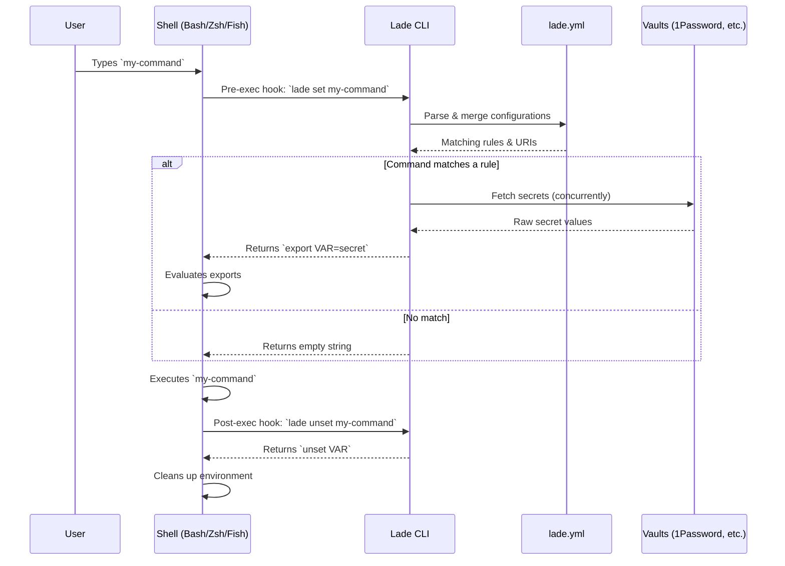
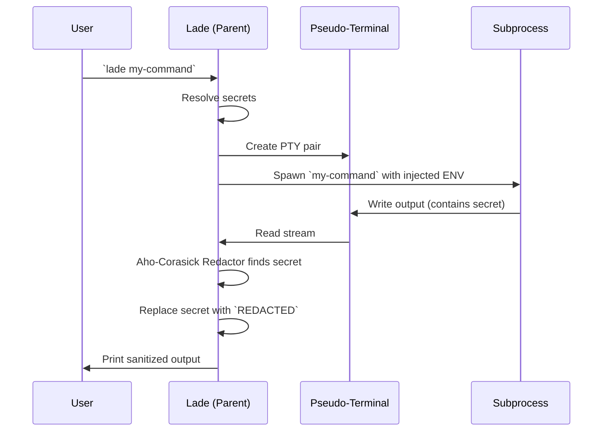
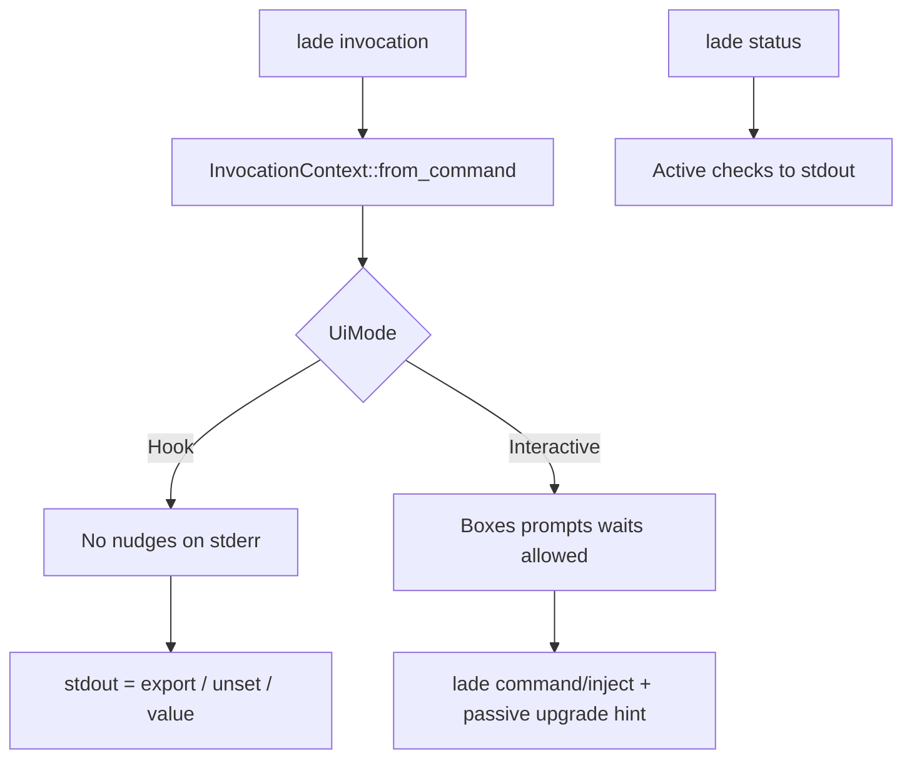

# Lade Architecture

This document provides an overview of Lade's internal architecture, explaining how commands are intercepted, how configurations are resolved, and how secrets are securely injected and masked.

## 1. High-Level Flow (Shell Hooks)

When a user runs `lade on`, Lade registers a pre-execution hook in their shell (Bash, Zsh, or Fish). This hook intercepts commands before they are run to check if they require secrets.



## 2. Configuration Resolution

Lade traverses the directory tree upwards to find and merge all `lade.yml` files. It then evaluates the rules against the current command.

```mermaid
flowchart TD
    Start[Command: `npm run build`] --> Find[Find all `lade.yml` from CWD to Git Root]
    Find --> Merge[Merge configs (deep merge)]
    Merge --> Match{Regex matches command?}

    Match -- Yes --> UserCheck{Is user specified?}
    UserCheck -- Yes --> ResolveUser[Resolve for specific user or fallback to `.']
    UserCheck -- No --> ResolveUser

    ResolveUser --> Loaders[Dispatch to Loaders]

    Match -- No --> Skip[Skip rule]

    Loaders --> |op://| OpLoader[1Password CLI]
    Loaders --> |vault://| VaultLoader[HashiCorp Vault]
    Loaders --> |file://| FileLoader[Local File]
    Loaders --> |Raw| RawLoader[Plaintext]
```

## 3. Execution & Masking (`lade <command>` / `lade inject <command>`)

When using the top-level shortcut `lade <command>` (or the explicit form `lade inject <command>`, or in environments where shell hooks aren't available), Lade wraps the command execution. It uses a pseudo-terminal (PTY) to capture the output and redact secrets on the fly.



## 4. UI policy (Hook vs Interactive)

Shell hooks call `lade set` / `lade unset` inside **preexec/postexec**. At that moment the shell still owns the TTY: input echo and line editing are unreliable (see [fish-shell#8484](https://github.com/fish-shell/fish-shell/issues/8484)). Lade therefore treats hook invocations as **Hook** mode: no nudges, no prompts, no timed waits on stderr. stdout remains the shell protocol (`export` / `unset`).

**Interactive** mode applies only to injected execution (`lade <command>` or `lade inject <command>`) when **both** stdin and stderr are TTYs. That is the path where disclaimers, provider warnings, compat notices, upgrade reminders, and `Lade loaded` may appear.



| Surface | Hook | Interactive |
|---------|------|-------------|
| Disclaimer prompt | fail closed + withhold secrets, single box, exit 3 (`DISCLAIMER_WITHHELD`); shell-hook `set` also emits `LADE_PENDING` | box + type `yes` |
| Provider warnings + 5s wait | silent | box + wait |
| `Lade loaded` | silent | eprintln |
| Compat CLI warning | silent | passive box + auto snooze |
| Upgrade reminder | silent | passive info box after inject |
| Loader error | one-line stderr + exit 1 | error box + wait + exit 1 |

Secret resolution (`hydrate_secrets`) is UI-free. Presentation (`prepare_secrets`) applies the policy above.

### Disclaimer Flow

Interactive prompts are forbidden in hook mode due to shell limitations (stdin hijacking, lack of echo). When a command matches a rule with a `disclaimer:`, the hook flow behaves as follows:

1. **`lade set`** (preexec) detects the disclaimer.
2. It outputs `unset LADE_PENDING` to clear any stale state.
3. It outputs `export LADE_PENDING=v1:...` (base64url JSON of cmd and cwd).
4. It prints the disclaimer text in a single **Warning MessageBox** to stderr and exits with code 3 (`DISCLAIMER_WITHHELD`). It is not a loader failure, so no second error box is shown.
5. The user's command runs **without secrets** (fail-closed).
6. To proceed, the user runs **`lade approve <code>`** with the code shown in the message.
7. `lade approve` reads `LADE_PENDING`, verifies the code against the pending command, and executes it (equivalent to injected execution via `lade <command>` / `lade inject <command>`). The explicit code is the consent, so it proceeds without further prompting.

Alternatively, the user can approve up front by prefixing the command with the per-command code shown in the message: **`LADE_APPROVE=<code>`**. The code is `sha256(command + window)` truncated to 5 hex chars, where `window = unix_time / 300` (5 min); validation accepts the current and previous window. It is intentionally **not** a secret (an agent could recompute it) — its purpose is to break the scriptable `LADE_APPROVE=1` reflex and force a deliberate, fresh copy per command. There is no blanket bypass.

Note: Fish `preexec` cannot cancel the main command. Lade's security model relies on withholding the secrets rather than preventing execution.

### Hook Short-Circuit

To avoid recursion and unnecessary overhead, shell hooks skip any command starting with `lade ` or exactly `lade`. This ensures `lade approve`, `lade status`, and `lade upgrade` never trigger their own hooks. The implementation uses ultra-fast string slicing (`${1:0:5}` in Bash/Zsh, `string sub` in Fish) to match the prefix exactly without using regex or glob wildcards.

Use `lade status` for an active report (version, config, hooks, `lade.yml`, vault CLI versions). Upgrade and compat nudges on inject only remind you to run `lade upgrade` or `lade status`.

## 5. Agents (`lade hook`) & the direct path

Lade distinguishes three driving contexts, each wanting different disclaimer behaviour:

| Context | How Lade knows | Disclaimer behaviour |
|---------|----------------|----------------------|
| Interactive human | stdin + stderr are TTYs | prompt, type `yes` |
| CI / non-interactive | non-TTY (and no agent signal) | fail-closed, exit `3` (disclaimers are a human gate; no blanket bypass) |
| Agent | `lade hook` invoked (agent-by-construction) or env heuristic on the direct path | hook: surface human-in-the-loop; direct: fail-closed with a machine-actionable message |

### Hook path: agent-by-construction

`lade hook` (`src/hook/`) is the recommended transparent integration. Because the agent literally invokes the hook before running a tool command, **`lade hook` ⇒ an agent is driving** — no env detection is needed. It reads the `preToolUse`/`PreToolUse` tool-call JSON from stdin and rewrites a matching command into `lade inject '<command>'` (so secrets are redacted out of the model's context window) via `allow` + `updated_input`/`updatedInput`. Schemas: <https://cursor.com/docs/agent/hooks>, <https://code.claude.com/docs/en/hooks>.

Disclaimers are **not** special-cased in the hook. The rewrite is uniform, and `lade inject` is the single source of truth: when the wrapped command carries an unapproved `disclaimer:`, `lade inject` prints the disclaimer plus a per-command `LADE_APPROVE=<code>` to stderr and fails closed (exit `3`) — see `prompt::resolve_disclaimers`. The human reads it in the tool output and re-runs the command with that code. The hook re-emits any leading `LADE_APPROVE=...` (or other env assignment) **before** `lade inject` (see `platform::split_env_prefix`) so the approval lands in the wrapped process's environment. This keeps one code path and avoids Cursor's `deny` dead-end (a `deny` makes the agent treat the command as forbidden rather than pending human approval).

### Installing the hook (`src/agent_hooks/`)

`lade install` is global and once-only, so it also offers to wire `lade hook` into the agents present on the machine — detected by a `~/.cursor` or `~/.claude` directory. It writes the absolute `lade hook` command to the agent's **global** config (`~/.cursor/hooks.json` `preToolUse`/`Shell`, `~/.claude/settings.json` `PreToolUse`/`Bash`), merging idempotently so unrelated hooks and settings are preserved; `lade uninstall` removes only our entry. Prompts only fire when stdin and stderr are TTYs (a detected-but-unconfigured agent is reported otherwise). The pure JSON merge/remove logic lives in `src/agent_hooks/config.rs`; project-local configs remain a manual copy-paste (README).

### Direct path: best-effort agent detection

On the direct `lade inject` / `lade <cmd>` path there is no hook signal, so `src/agent.rs` uses a heuristic only to tailor the fail-closed message (it does not change whether secrets are withheld). Precedence: `AI_AGENT` (Vercel `@vercel/detect-agent`) → `AGENT` (community proposal, [agents.md#136](https://github.com/agentsmd/agents.md/issues/136)) → `CLAUDECODE=1` → `CURSOR_AGENT` → `COPILOT_MODEL` → `CURSOR_VERSION` (ambiguous: also set in a human's Cursor terminal). Gemini CLI has no detection variable.

### Exit codes

`src/exit_codes.rs` defines stable, documented codes (kept stable across minor versions; convention follows [InfoQ "Patterns for AI Agent Driven CLIs"](https://www.infoq.com/articles/ai-agent-cli/)):

| Code | Meaning |
|------|---------|
| `0` | success |
| `1` | config / loader / generic error |
| `3` | `DISCLAIMER_WITHHELD` (direct inject/approve fail-closed) |
| `130` | interrupted (Ctrl-C / SIGINT) |
| child's code | `lade inject` passes the wrapped command's exit code through unchanged |

### MCP: out of scope

An MCP server is a deliberate non-goal. Lade is an interceptor, not a data source, so the agent already knows how to drive it via the CLI; an MCP surface would add context cost for no benefit.
