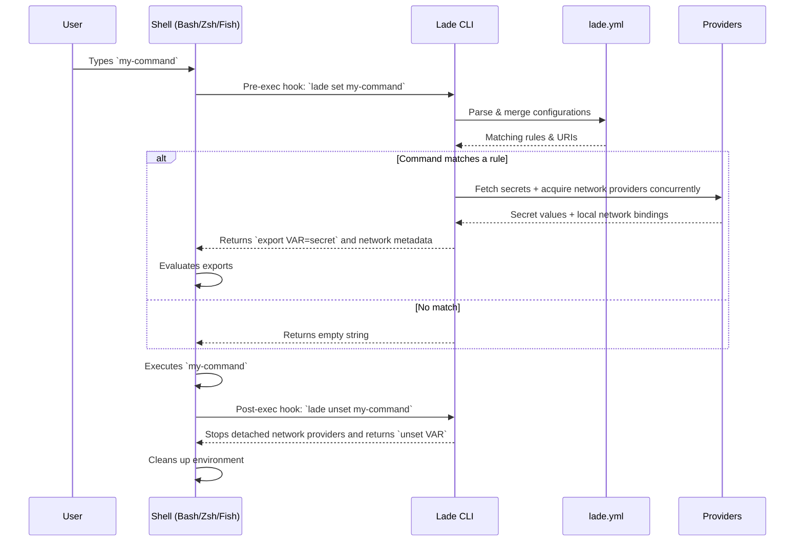
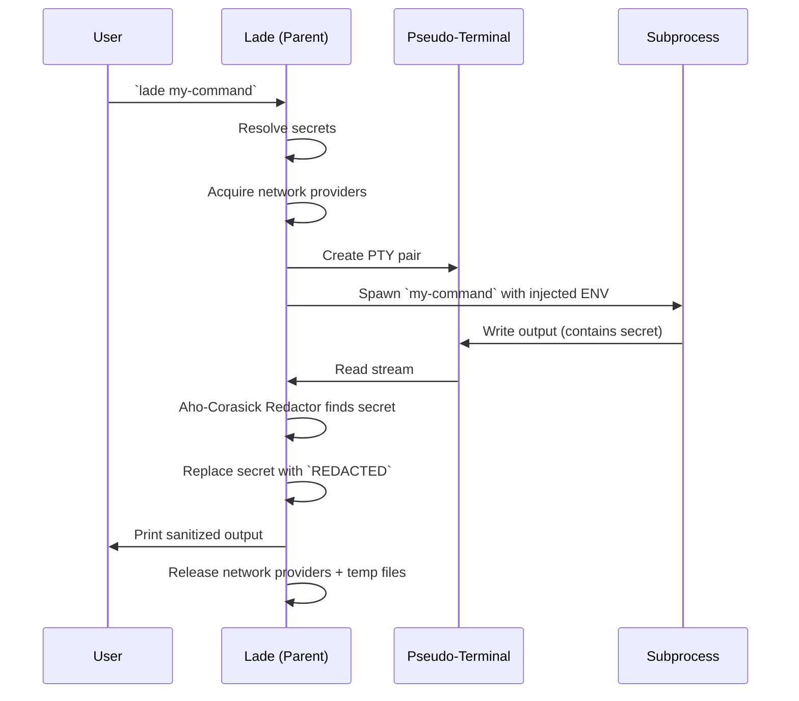
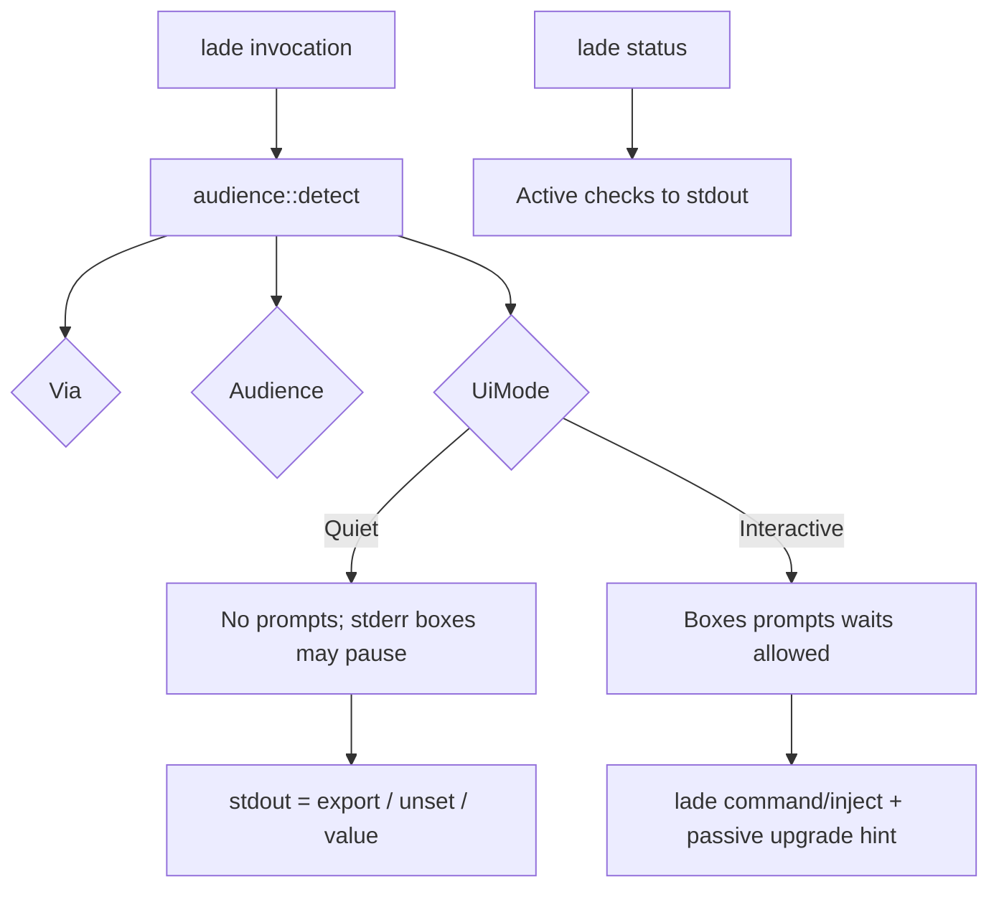

# Lade Architecture

This document provides an overview of Lade's internal architecture, explaining how commands are intercepted, how configurations are resolved, and how secrets are securely injected and masked.

## 1. High-Level Flow (Shell Hooks)

When a user runs `lade on`, Lade registers a pre-execution hook in their shell (Bash, Zsh, or Fish). This hook intercepts commands before they are run to check if they require secrets.


```mermaid
sequenceDiagram
    participant User
    participant Shell as Shell (Bash/Zsh/Fish)
    participant Lade as Lade CLI
    participant Config as lade.yml
    participant Providers as Providers

    User->>Shell: Types `my-command`
    Shell->>Lade: Pre-exec hook: `lade set my-command`
    Lade->>Config: Parse & merge configurations
    Config-->>Lade: Matching rules & URIs

    alt Command matches a rule
        Lade->>Providers: Fetch secrets + acquire network providers concurrently
        Providers-->>Lade: Secret values + local network bindings
        Lade-->>Shell: Returns `export VAR=secret` and network metadata
        Shell->>Shell: Evaluates exports
    else No match
        Lade-->>Shell: Returns empty string
    end

    Shell->>Shell: Executes `my-command`
    Shell->>Lade: Post-exec hook: `lade unset my-command`
    Lade-->>Shell: Stops detached network providers and returns `unset VAR`
    Shell->>Shell: Cleans up environment
```

## 2. Configuration Resolution

Lade traverses the directory tree upwards to find and merge all `lade.yml` files. It then evaluates the rules against the current command.

```mermaid
flowchart TD
    Start[Command: `npm run build`] --> Find[Find all `lade.yml` from CWD to Git Root]
    Find --> Merge[Merge configs (deep merge)]
    Merge --> Match{Regex matches command?}

    Match -- Yes --> UserCheck{Is user specified?}
    UserCheck -- Yes --> ResolveUser[Resolve for specific user or fallback to `.']
    UserCheck -- No --> ResolveUser

    ResolveUser --> Loaders[Dispatch to Providers]

    Match -- No --> Skip[Skip rule]

    Loaders --> |op:// vault:// sh:// ...| SecretProviders[Secret Providers]
    Loaders --> |kubectl:// kubefwd:// tsh:// ssh://| NetworkProviders[Network Providers]
```

Lade keeps two provider families under one registry:

- **Secret providers** resolve values (env/file hydration).
- **Network providers** acquire temporary local port bindings for the command.

For shell hooks, `lade set` must finish both secret hydration and network
acquisition before it can print the shell exports. When a matching rule contains
network providers, the visible pre-command latency is therefore the slower of
secret resolution and tunnel readiness.

## 3. Execution, Network Acquire & Masking (`lade <command>` / `lade inject <command>`)

When using the top-level shortcut `lade <command>` (or the explicit form
`lade inject <command>`, or in environments where shell hooks aren't
available), Lade wraps the command execution. It resolves secrets, acquires any
matching network providers, then starts the child command. It uses a
pseudo-terminal (PTY) to capture output and redact secret values on the fly.


```mermaid
sequenceDiagram
    participant User
    participant Lade as Lade (Parent)
    participant PTY as Pseudo-Terminal
    participant Child as Subprocess

    User->>Lade: `lade my-command`
    Lade->>Lade: Resolve secrets
    Lade->>Lade: Acquire network providers
    Lade->>PTY: Create PTY pair
    Lade->>Child: Spawn `my-command` with injected ENV

    Child->>PTY: Write output (contains secret)
    PTY->>Lade: Read stream

    Lade->>Lade: Aho-Corasick Redactor finds secret
    Lade->>Lade: Replace secret with `REDACTED`

    Lade->>User: Print sanitized output
    Lade->>Lade: Release network providers + temp files
```

Network provider notes:

- URI parsing is strict for known network schemes; malformed URIs fail rather than falling back to raw values.

## 4. Via, Audience, UI

Every invocation runs `audience::detect(command, stdin_tty, stderr_tty)`. That
single function returns Via, Audience, and UiMode. TTY is an input; Quiet vs
Interactive is an output. Callers use `ctx.audience` for `.when` and
`ctx.is_interactive()` for prompts.

- **Via** (`LADE_VIA`): `preexec` (`lade set`/`unset`), `pretool` (`lade hook`
  rewrite), or unset. An unknown value fails fast.
- **Audience** (`.when`): `human` / `agent`. Pretool is agent, preexec is human,
  unset falls back to env signals (`AI_AGENT`, `AGENT`, `CLAUDECODE`,
  `CURSOR_AGENT`, `COPILOT_MODEL`). `CURSOR_VERSION` is ignored: Cursor also
  sets it in human terminals.
- **UI**: Interactive only for human `inject`/`approve` with both stdin and
  stderr as TTYs. Everything else is Quiet, including an agent that happens to
  have a TTY.

preexec still owns the TTY (see [fish-shell#8484](https://github.com/fish-shell/fish-shell/issues/8484)), so `lade set`/`unset` are Quiet: stdout is the shell protocol (`export` / `unset`). Warnings and errors still render on stderr.


```mermaid
flowchart TD
    Start[lade invocation] --> Detect[audience::detect]
    Detect --> Via{Via}
    Detect --> Aud{Audience}
    Detect --> Mode{UiMode}
    Mode -->|Quiet| QuietUi[No prompts; stderr boxes may pause]
    Mode -->|Interactive| Nudges[Boxes prompts waits allowed]
    QuietUi --> Stdout[stdout = export / unset / value]
    Nudges --> Inject[lade command/inject + passive upgrade hint]
    Status[lade status] --> Report[Active checks to stdout]
```

## 5. Binding resolution

Every matching command builds a dependency DAG from its bindings before any
provider is invoked. A binding can reference another binding with `${NAME}`.
Ready bindings resolve concurrently; as a provider group completes, its
dependents become eligible immediately. The graph and its values are scoped to
one invocation.

Keys prefixed with `.` are intermediate bindings. `.NAME` resolves and can be
referenced as `$NAME` or `${NAME}`, but is never written to the child environment, a
temporary file, or an MCP header. `.` on its own is still the rule
configuration block. A public binding and `.NAME` cannot coexist.

Binding sources support simple `$NAME` and `${NAME}` references. For normal
providers, Lade renders those references before invoking the provider. Shell
providers (`sh://`, `bash://`, `zsh://`, `fish://`) are different: the source
script remains unchanged and direct binding dependencies are injected into that
shell process environment. This preserves shell syntax such as command
substitution and pipes without placing secret values in the script text.

```yaml
"deploy .*":
  .TOKEN: op://company/production/deploy/token
  DEPLOY_AUTHORIZATION: "Bearer ${TOKEN}"
```

The child receives only `DEPLOY_AUTHORIZATION`; `TOKEN` remains resolver-local.
This is independent of the final sink, so the same pattern works for shell
hooks, `lade inject`, file output, and MCP.

## 6. MCP

`lade mcp` uses the same rule matcher and binding resolver as command
injection, but the output sink depends on the transport. A stdio target is
spawned directly with public bindings in its environment. An HTTPS target is
exposed locally as stdio and each public binding becomes an upstream HTTP
header.

MCP stdout is protocol data and is copied without redaction or decoration.
Lade diagnostics use stderr. The resolver, temporary files, and network
forwards are owned by the invocation and cleaned up when the transport exits.

| Surface | Quiet | Interactive |
|---------|------|-------------|
| Disclaimer prompt | fail closed + withhold secrets, single box, exit 3 (`DISCLAIMER_WITHHELD`); shell-hook `set` also emits `LADE_PENDING` | box + type `yes` |
| Provider warnings | box + 2s wait when stderr is a TTY | box + 2s wait |
| `Lade loaded` | silent | eprintln |
| Compat CLI warning | silent | passive box + auto snooze |
| Upgrade reminder | silent daily check | passive info box after inject |
| Loader/network error | error box + 5s wait when stderr is a TTY + exit 1 | error box + 5s wait + exit 1 |
| Network providers | acquired by `lade set` as detached processes, stopped by `lade unset` | acquired before child command, released on exit |

Secret resolution (`hydrate_secrets`) is UI-free. Presentation
(`prepare_secrets`) applies the policy above. Network providers are acquired
alongside secrets on both the shell-hook and inject paths; hook mode stores
detached provider PIDs in the shell environment so `lade unset` can stop them.

### Disclaimer Flow

Interactive prompts are forbidden in hook mode due to shell limitations (stdin hijacking, lack of echo). When a command matches a rule with a `disclaimer:`, the hook flow behaves as follows:

1. **`lade set`** (preexec) detects the disclaimer.
2. It outputs `unset LADE_PENDING` to clear any stale state.
3. It outputs `export LADE_PENDING=v1:...` (base64url JSON of cmd and cwd).
4. It prints the disclaimer text in a single **Warning MessageBox** to stderr and exits with code 3 (`DISCLAIMER_WITHHELD`). It is not a loader failure, so no second error box is shown.
5. The user's command runs **without secrets** (fail-closed).
6. To proceed, the user runs **`lade approve <code>`** with the code shown in the message.
7. `lade approve` reads `LADE_PENDING`, verifies the code against the pending command, and executes it (equivalent to injected execution via `lade <command>` / `lade inject <command>`). The explicit code is the consent, so it proceeds without further prompting.

Alternatively, the user can approve up front by prefixing the command with the per-command code shown in the message: **`LADE_APPROVE=<code>`**. The code is `sha256(command + window)` truncated to 5 hex chars, where `window = unix_time / 300` (5 min); validation accepts the current and previous window. It is intentionally **not** a secret (an agent could recompute it) — its purpose is to break the scriptable `LADE_APPROVE=1` reflex and force a deliberate, fresh copy per command. There is no blanket bypass.

Note: Fish `preexec` cannot cancel the main command. Lade's security model relies on withholding the secrets rather than preventing execution.

### Preexec short-circuit

To avoid recursion and unnecessary overhead, preexec shell hooks skip any command starting with `lade ` or exactly `lade`. This ensures `lade approve`, `lade status`, and `lade upgrade` never trigger their own preexec. The implementation uses ultra-fast string slicing (`${1:0:5}` in Bash/Zsh, `string sub` in Fish) to match the prefix exactly without using regex or glob wildcards.

Use `lade status` for an active report (version, config, preexec and preTool hooks, `lade.yml`, vault CLI versions). Upgrade and compat nudges on inject only remind you to run `lade upgrade` or `lade status`.

## 7. Agents (`lade hook`) and the direct path

`audience::detect` is the only classifier. Disclaimer UI still follows Quiet vs Interactive (an output of that same function).

| Context | How Lade knows | Disclaimer behaviour |
|---------|----------------|----------------------|
| Interactive human | Via unset, no agent signal, inject/approve with both TTYs | prompt, type `yes` |
| CI / Quiet human | no agent signal, not both TTYs | fail-closed, exit `3` |
| Agent | Via=pretool, `Command::Hook`, or env signal when Via is unset | fail-closed with `LADE_APPROVE=<code>` |

### preTool path

`lade hook` (`src/pretool/`) reads Cursor/Claude preToolUse JSON and rewrites a matching command into `LADE_VIA=pretool <lade> inject '…'`. Schemas: <https://cursor.com/docs/agent/hooks>, <https://code.claude.com/docs/en/hooks>.

Disclaimers are not special-cased in `lade hook`. `lade inject` is the gate. The rewrite re-emits leading `LADE_APPROVE=...` before inject (`platform::split_env_prefix`).

### Installing preTool hooks (`src/pretool/install/`)

`lade install` offers to wire `lade hook` into agents present on the machine (`~/.cursor`, `~/.claude`). It writes the absolute `lade hook` command to global config (`~/.cursor/hooks.json`, `~/.claude/settings.json`). Project-local configs remain a copy-paste (README). `lade status` reports both global and project paths.

### Direct path

When Via is unset (`lade inject`, `lade mcp`, `lade git …`), `detect()` uses env signals: `AI_AGENT` → `AGENT` → `CLAUDECODE=1` → `CURSOR_AGENT` → `COPILOT_MODEL`. `CURSOR_VERSION` is ignored because Cursor also sets it in human terminals. That classification selects `.when` rules and the fail-closed disclaimer wording.

### Exit codes

`src/exit_codes.rs` defines stable, documented codes (kept stable across minor versions; convention follows [InfoQ "Patterns for AI Agent Driven CLIs"](https://www.infoq.com/articles/ai-agent-cli/)):

| Code | Meaning |
|------|---------|
| `0` | success |
| `1` | config / loader / generic error |
| `3` | `DISCLAIMER_WITHHELD` (direct inject/approve fail-closed) |
| `130` | interrupted (Ctrl-C / SIGINT) |
| child's code | `lade inject` passes the wrapped command's exit code through unchanged |

### MCP: out of scope

An MCP server is a deliberate non-goal. Lade is an interceptor, not a data source, so the agent already knows how to drive it via the CLI; an MCP surface would add context cost for no benefit.
