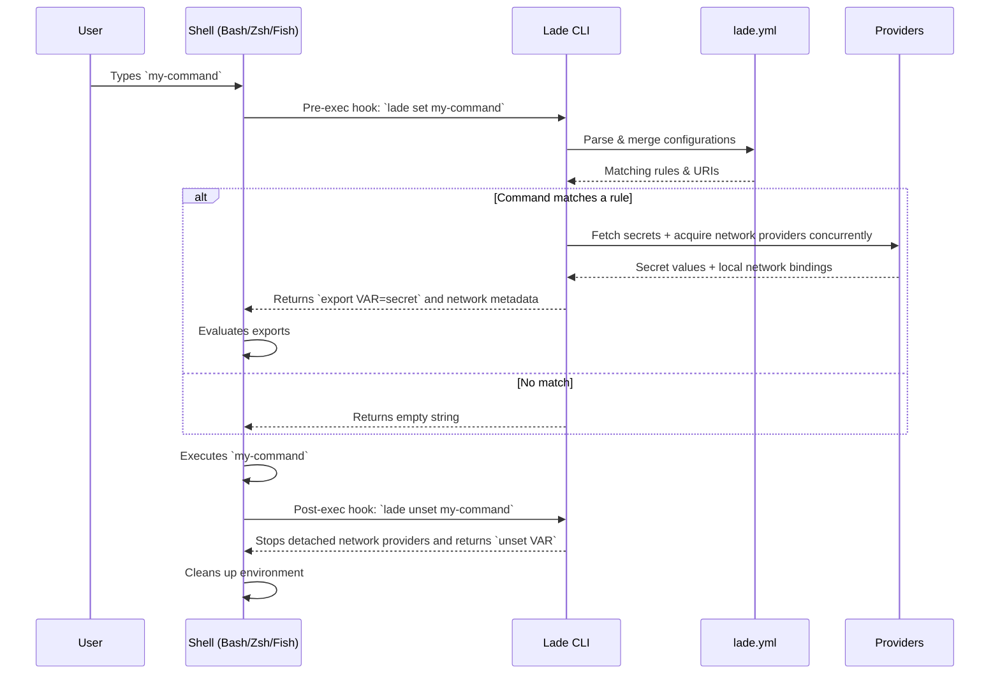
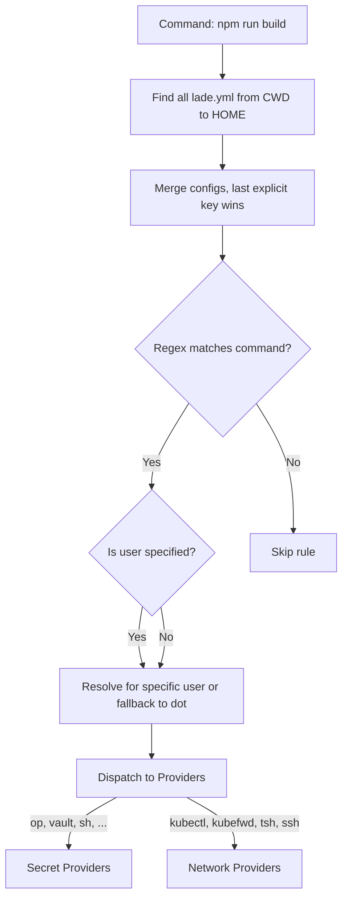
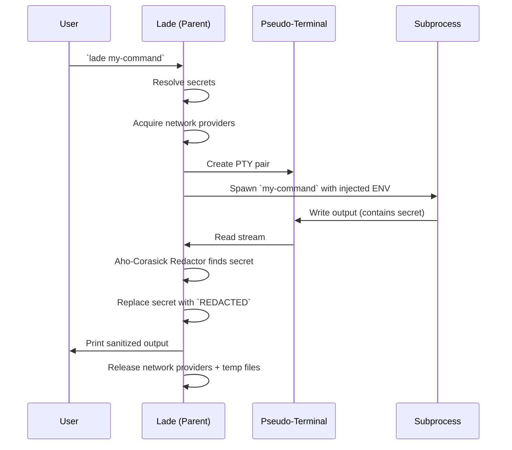
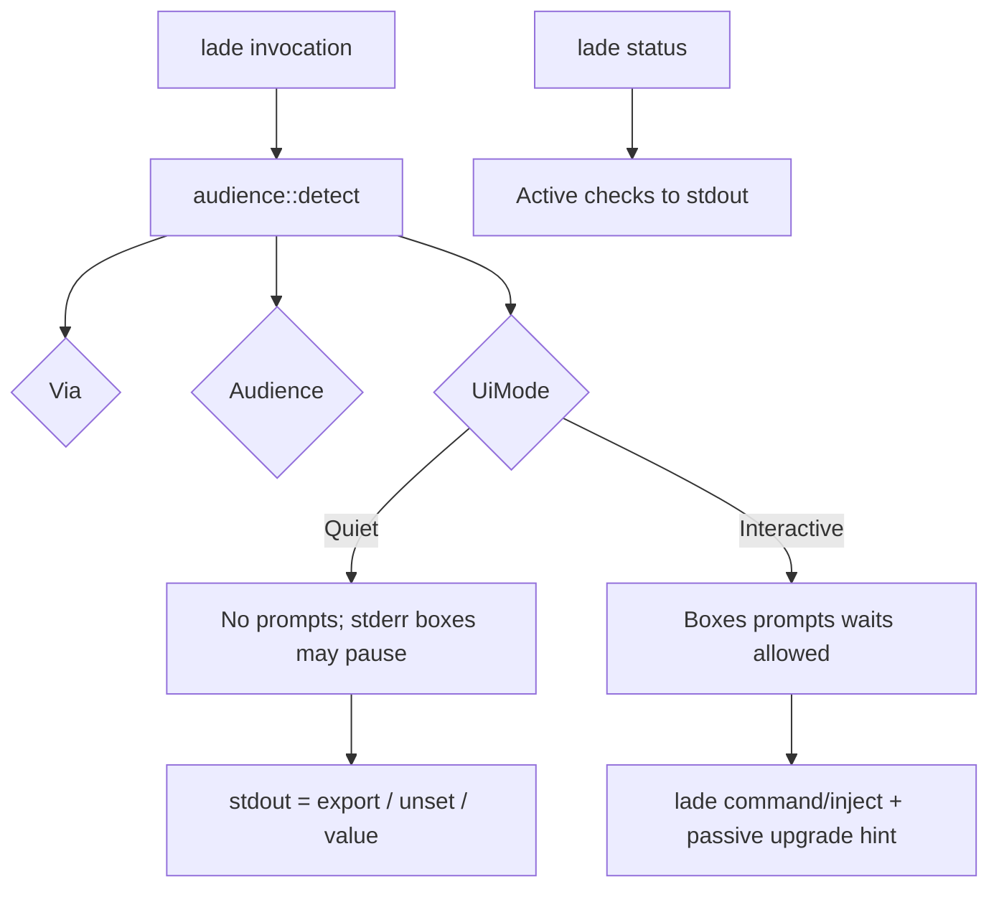

# Lade Architecture

Match tickets (T) are specified in [protocol.md](protocol.md).
Observability is specified in [observability.md](observability.md).

## 1. High-Level Flow (Shell Hooks)

When a user runs `lade on`, Lade registers a pre-exec hook in their shell (Bash, Zsh, or Fish). This hook intercepts commands before they are run to check if they require secrets.


```mermaid
sequenceDiagram
    participant User
    participant Shell as Shell (Bash/Zsh/Fish)
    participant Lade as Lade CLI
    participant Config as lade.yml
    participant Providers as Providers

    User->>Shell: Types `my-command`
    Shell->>Lade: Pre-exec hook: `lade set my-command`
    Lade->>Config: Parse & merge configurations
    Config-->>Lade: Matching rules & URIs

    alt Command matches a rule
        Lade->>Providers: Fetch secrets + acquire network providers concurrently
        Providers-->>Lade: Secret values + local network bindings
        Lade-->>Shell: Returns `export VAR=secret` and network metadata
        Shell->>Shell: Evaluates exports
    else No match
        Lade-->>Shell: Returns empty string
    end

    Shell->>Shell: Executes `my-command`
    Shell->>Lade: Post-exec hook: `lade unset my-command`
    Lade-->>Shell: Stops detached network providers and returns `unset VAR`
    Shell->>Shell: Cleans up environment
```

## 2. Configuration Resolution

Lade walks from the current directory up to `$HOME`, loads every
`lade.yml` / `lade.yaml` it finds, then evaluates the rules against
the current command. `~/lade.yml` is included. Parents above `$HOME`
are not. A later file overlays the same key. Last explicit `log`
wins.


```mermaid
flowchart TD
    Start["Command: npm run build"] --> Find["Find all lade.yml from CWD to HOME"]
    Find --> Merge["Merge configs, last explicit key wins"]
    Merge --> Match{"Regex matches command?"}

    Match -- Yes --> UserCheck{"Is user specified?"}
    UserCheck -- Yes --> ResolveUser["Resolve for specific user or fallback to dot"]
    UserCheck -- No --> ResolveUser

    ResolveUser --> Loaders["Dispatch to Providers"]

    Match -- No --> Skip["Skip rule"]

    Loaders --> |"op, vault, sh, ..."| SecretProviders["Secret Providers"]
    Loaders --> |"kubectl, kubefwd, tsh, ssh"| NetworkProviders["Network Providers"]
```

Lade keeps two provider families under one registry:

- **Secret providers** resolve values (env/file hydration).
- **Network providers** acquire temporary local port bindings for the command.

URI parse, CLI version tables, and tunnel command builders live in
`lade-sdk`. The CLI owns process lifecycle (spawn, ready wait,
restart, kill).

For shell hooks, `lade set` must finish both secret hydration and network
acquisition before it can print the shell exports. When a matching rule contains
network providers, the visible pre-command latency is therefore the slower of
secret resolution and tunnel readiness.

## 3. Execution, Network Acquire & Masking (`lade <command>` / `lade inject <command>`)

When using the top-level shortcut `lade <command>` (or the explicit form
`lade inject <command>`, or in environments where shell hooks aren't
available), Lade wraps the command execution. It resolves secrets, acquires any
matching network providers, then starts the child command. The wrap skips
the user profile (`fish --no-config`, `zsh -f`, `$BASH_ENV` unset) so
startup files cannot overwrite a resolved secret. It uses a
pseudo-terminal (PTY) to capture output and redact secret values on the fly.
Hangup is ignored. Stop signals end the wrapper. `USR1` / `USR2` / `WINCH`
are forwarded.


```mermaid
sequenceDiagram
    participant User
    participant Lade as Lade (Parent)
    participant PTY as Pseudo-Terminal
    participant Child as Subprocess

    User->>Lade: `lade my-command`
    Lade->>Lade: Resolve secrets
    Lade->>Lade: Acquire network providers
    Lade->>PTY: Create PTY pair
    Lade->>Child: Spawn `my-command` with injected ENV

    Child->>PTY: Write output (contains secret)
    PTY->>Lade: Read stream

    Lade->>Lade: Aho-Corasick Redactor finds secret
    Lade->>Lade: Replace secret with `REDACTED`

    Lade->>User: Print sanitized output
    Lade->>Lade: Release network providers + temp files
```

Network provider notes:

- URI parsing is strict for known network schemes; malformed URIs fail rather than falling back to raw values.
- Command argv and kube context resolve come from `lade-sdk`. The CLI only spawns, waits for the port, and tears down.

## 4. Via, Audience, UI

Every invocation runs `audience::detect(command, pretool, stdin_tty, stderr_tty)`.
That single function returns Via, Audience, and UiMode. TTY is an input; Quiet vs
Interactive is an output. Callers use `ctx.audience` for `.when` and
`ctx.is_interactive()` for prompts.

- **Via**: `--pretool` wins, then the subcommand (`set`/`unset` are preexec,
  `hook` is pretool), else unset. Leftover `LADE_VIA` is ignored. The
  pretool handler rewrites to `<bin> --pretool=<id> '…'` (`lade` when
  invoked as `lade`). Via is stored on the ticket, not stamped onto the
  child env. Preexec `set` writes T on every match and exports `LADE_T`.
  See [protocol.md](protocol.md).
- **Audience** (`.when`): `human` / `agent`. Pretool is agent, preexec is human,
  unset falls back to env signals (`AI_AGENT`, `AGENT`, `CLAUDECODE`,
  `CLAUDE_CODE`, `CURSOR_AGENT`, `CURSOR_EXTENSION_HOST_ROLE`,
  `CURSOR_SANDBOX`, `CODEX_*`, `PI_*`, `OPENCODE*`, `COPILOT_MODEL`).
  `CURSOR_VERSION` is ignored: Cursor also sets it in human terminals.
  Optional diary metadata (`harness`, `model`, `session`) is collected from
  the hook payload and env (`src/agent_meta.rs`), stored on the T pre-event
  and in `events.agent`.
- **UI**: Interactive only for human `inject`/`approve` with both stdin and
  stderr as TTYs. Everything else is Quiet, including an agent that happens to
  have a TTY.

preexec still owns the TTY (see [fish-shell#8484](https://github.com/fish-shell/fish-shell/issues/8484)), so `lade set`/`unset` are Quiet: stdout is the shell protocol (`export` / `unset`). Warnings and errors still render on stderr.


```mermaid
flowchart TD
    Start[lade invocation] --> Detect[audience::detect]
    Detect --> Via{Via}
    Detect --> Aud{Audience}
    Detect --> Mode{UiMode}
    Mode -->|Quiet| QuietUi[No prompts; stderr boxes may pause]
    Mode -->|Interactive| Nudges[Boxes prompts waits allowed]
    QuietUi --> Stdout[stdout = export / unset / value]
    Nudges --> Inject[lade command/inject + passive upgrade hint]
    Status[lade status] --> Report[Active checks to stdout]
```

## 5. Binding resolution

Every matching command builds a dependency DAG from its bindings before any
provider is invoked. A binding can reference another binding with `${NAME}`.
Ready bindings resolve concurrently; as a provider group completes, its
dependents become eligible immediately. The graph and its values are scoped to
one invocation.

Keys prefixed with `.` are intermediate bindings. `.NAME` resolves and can be
referenced as `$NAME` or `${NAME}`, but is never written to the child environment, a
temporary file, or an MCP header. `.` on its own is still the rule
configuration block (`file`, `disclaimer`, `when`, `silence`, `log`).
`silence: true` skips that rule's secret progress lines. Hydration
itself is unchanged. A public binding and `.NAME` cannot coexist.

Binding sources support simple `$NAME` and `${NAME}` references. For normal
providers, Lade renders those references before invoking the provider. Shell
providers (`sh://`, `bash://`, `zsh://`, `fish://`) are different: the source
script remains unchanged and direct binding dependencies are injected into that
shell process environment. This preserves shell syntax such as command
substitution and pipes without placing secret values in the script text.

```yaml
"deploy .*":
  .TOKEN: op://company/production/deploy/token
  DEPLOY_AUTHORIZATION: "Bearer ${TOKEN}"
```

The child receives only `DEPLOY_AUTHORIZATION`; `TOKEN` remains resolver-local.
This is independent of the final sink, so the same pattern works for shell
hooks, `lade inject`, file output, and MCP.

## 6. MCP

`lade mcp` hydrates a server process. Every MCP `tools/call` that
reaches `lade hook` is a verb row. Diary shapes are in
[observability.md](observability.md).

`lade mcp` uses the same rule matcher and binding resolver as command
injection, but the output sink depends on the transport. A stdio target is
spawned directly with public bindings in its environment. An HTTPS target is
exposed locally as stdio and each public binding becomes an upstream HTTP
header. If a stdio child exits before the client `initialize` line is
forwarded, Lade respawns it with the already hydrated env. After
`initialize`, a child exit does not restart.

MCP stdout is protocol data and is copied without redaction or decoration.
Lade diagnostics use stderr. The resolver, temporary files, and network
forwards are owned by the invocation and cleaned up when the transport exits.

| Surface | Quiet | Interactive |
|---------|------|-------------|
| Disclaimer prompt | fail closed + withhold secrets, single box, exit 3 (`DISCLAIMER_WITHHELD`); shell-hook `set` writes T with `pending` and exports `LADE_T` | box + type `yes` |
| Provider warnings | box + 2s wait when stderr is a TTY | box + 2s wait |
| `Lade loaded` | silent | eprintln |
| Compat CLI warning | silent | passive box + auto snooze |
| Upgrade reminder | silent daily check | passive info box after inject |
| Loader/network error | error box + 5s wait when stderr is a TTY + exit 1 | error box + 5s wait + exit 1 |
| Network providers | acquired by `lade set` as detached processes, stopped by `lade unset` | acquired before child command, released on exit |

Secret resolution (`hydrate_secrets`) is UI-free. Presentation
(`prepare_secrets`) applies the policy above. Network providers are acquired
alongside secrets on both the shell-hook and inject paths; hook mode stores
detached provider PIDs on the T ticket so `lade unset` can stop them.

### Disclaimer Flow

Interactive prompts are forbidden in hook mode due to shell limitations (stdin hijacking, lack of echo). When a command matches a rule with a `disclaimer:`, the hook flow behaves as follows:

1. **`lade set`** (preexec) detects the disclaimer.
2. It outputs `unset` of `LADE_RESTORE` so a previous snapshot cannot leak into the next set.
3. It writes T with `pending: true` and outputs `export LADE_T=<id>`.
4. It prints the disclaimer text in a single **Warning MessageBox** to stderr and exits with code 3 (`DISCLAIMER_WITHHELD`). It is not a loader failure, so no second error box is shown.
5. The user's command runs **without secrets** (fail-closed).
6. To proceed, the user runs **`lade approve <code>`** with the code shown in the message.
7. `lade approve` reads T via `LADE_T`, requires `pending: true`, verifies the code against the pending command, and executes it (equivalent to injected execution via `lade <command>` / `lade inject <command>`). The explicit code is the consent, so it proceeds without further prompting.

Alternatively, the user can approve up front by prefixing the command with the per-command code shown in the message: **`LADE_APPROVE=<code>`**. The code is `sha256(command + window)` truncated to 5 hex chars, where `window = unix_time / 300` (5 min); validation accepts the current and previous window. It is intentionally **not** a secret (an agent could recompute it) — its purpose is to break the scriptable `LADE_APPROVE=1` reflex and force a deliberate, fresh copy per command. There is no blanket bypass.

Note: Fish `preexec` cannot cancel the main command. Lade's security model relies on withholding the secrets rather than preventing execution.

### Pre-exec short-circuit

Pre-exec hooks skip any command that starts with `lade ` or is exactly `lade`,
so `lade approve`, `lade status`, and `lade upgrade` do not wrap themselves.
The match is a prefix slice (`${1:0:5}` in Bash/Zsh, `string sub` in Fish).

Use `lade status` for an active report (version, config, pre-exec and
pre-tool, `lade.yml`, vault CLI versions, diary path and size).
`--json` keeps `version`, `global_config`, `hooks`, `project_config`,
and `ok`. `hooks` is `preexec` plus `pretool`. `log` is extra (`path`,
`events`, raw `bytes`). A successful daily GitHub check persists the
latest tag. Upgrade and compat nudges on inject only remind you to
run `lade upgrade` or `lade status`. `lade bench` times parse, match,
and per-rule hydrate. It does not acquire network.

## 7. Agents (`lade hook`) and the direct path

`audience::detect` is the only classifier. Disclaimer UI still follows Quiet vs Interactive (an output of that same function).

| Context | How Lade knows | Disclaimer behaviour |
|---------|----------------|----------------------|
| Interactive human | Via organic (both TTYs, no agent signal), inject/approve | prompt, type `yes` |
| CI / Quiet human | no agent signal, not both TTYs | fail-closed, exit `3` |
| Agent | Via=pretool, `Command::Hook` with no subcommand, or env signal when Via is unknown | fail-closed with `LADE_APPROVE=<code>` |

### pre-tool path

The **pretool handler** (`src/pretool/`, invoked as `lade hook`) reads
preToolUse JSON. Envelope comes from the payload first: `PreToolUse`
and explicit Codex signals use `hookSpecificOutput` +
`updatedInput`. Cursor's `updated_input` is only for `CURSOR_VERSION`
or `preToolUse`. OpenCode's plugin sends `{ command, session_id }` and
reads `{ command }` back. `CURSOR_VERSION` is last because Cursor also
sets it in other hosts' terminals.

On match it writes a T pre-event and rewrites to
`<lade> --pretool=<id> '…'`. That wrap **is** inject. On no match it
allows the original line and may write a `seen` row. Disclaimers are
not special-cased in the handler. Inject is the gate. The rewrite
re-emits leading `LADE_APPROVE=...` (`platform::split_env_prefix`).
The wrap runs providers from that file and unlinks it after the child.
The approve code is a 5-hex `sha256` of the command and a 5-minute
window, not the T id. See [protocol.md](protocol.md).

### Installing pre-tool (`src/pretool/install/`)

The binary embeds the repo snapshots and `.agents/skills/lade/SKILL.md` (a pointer skill: run commands normally, never eval / `--no-mask` / approve, `lade install` on drift). `lade install` writes pre-exec for this shell only and pre-tool (hook and skill together) on one plane: a git cwd defaults to the repo, otherwise this machine. `lade uninstall` uses that same default, then the other plane if the default is empty. `lade hook install --harness <slug>` defaults to project. Empty targets get the snapshot. Existing JSON is merged. APM ships the skill via a link at `.apm/skills/lade/SKILL.md` and pins the GitHub tag. `lade status` reports user (JSON `global`) and project. The daily check refreshes Lade-managed files. MCP verbs are allow-only.

### Direct path

When Via is not preexec, pretool, or mcp (`lade inject`, `lade git …`), `detect()` promotes to organic if stdin and stderr are TTYs and no agent env signal fired. Otherwise Via stays unknown. `lade mcp` is `Via::Mcp` / Agent. `detect()` then uses env signals: `AI_AGENT` → `AGENT` → `CLAUDECODE=1` → `CURSOR_AGENT` → `COPILOT_MODEL`. `CURSOR_VERSION` is ignored because Cursor also sets it in human terminals. That classification selects `.when` rules and the fail-closed disclaimer wording. Codex isolation is the pretool rewrite (`--pretool`), not an audience env signal.

### Exit codes

`src/exit_codes.rs` defines stable, documented codes (kept stable across minor versions; convention follows [InfoQ "Patterns for AI Agent Driven CLIs"](https://www.infoq.com/articles/ai-agent-cli/)):

| Code | Meaning |
|------|---------|
| `0` | success |
| `1` | config / loader / generic error |
| `3` | `DISCLAIMER_WITHHELD` (direct inject/approve fail-closed) |
| `130` | interrupted (Ctrl-C / SIGINT) |
| child's code | `lade inject` passes the wrapped command's exit code through unchanged |

### MCP: out of scope

An MCP server is a deliberate non-goal. Lade is an interceptor, not a data source, so the agent already knows how to drive it via the CLI; an MCP surface would add context cost for no benefit.

## 8. Observability

Recording is opt-in. Last explicit `log` on **matching** rules wins.
No-match `seen` uses last explicit `log` on the loaded walk. Secret
values are never stored. Vault addresses and public keys are.

Commands, schema, scrub, and share live in [observability.md](observability.md).
