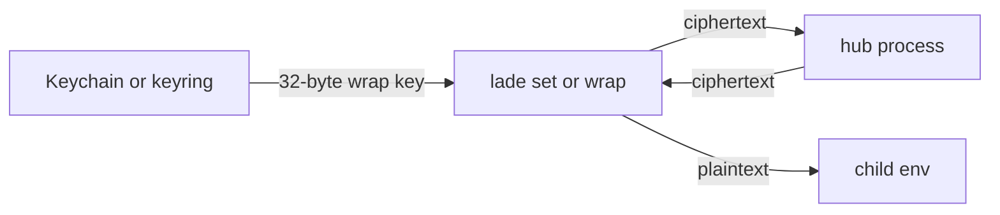

# Secret cache

In-memory hub for hydrated secrets. `terraform plan` then
`terraform apply` can reuse one rule body without a second vault
round trip. The hub stores ciphertext only. Tickets stay in
[protocol.md](protocol.md). The diary stays in
[observability.md](observability.md). Env overrides are in
[env.md](env.md).

## Opt in

`ttl:` sits on that rule body's `.` block. Not on the URI. Not
folded like `log`. A home `ttl` does not opt in a child's `sh://`.

```yaml
"terraform .*":
  .:
    ttl: 5m
  AWS_ACCESS_KEY_ID: op://vault/item/field
```

Two command lines. Two `lade set` processes. They share if they
hit the same rule body. Two patterns, or two `when:` bodies under
the same pattern: the second refetches. It does not fail.

| Binding on that body | Default | Opt-in |
|---|---|---|
| Vault / `op` / cloud / file / sops / age | 5m | `ttl: off` disables. `ttl: 1h` … `ttl: 24h` (max) |
| `sh` / `bash` / `zsh` / `fish` | off | that body writes `ttl:` (same max) |
| This cwd (hub window) | yaml / 5m | `lade cache set 2h` marks this cwd. Ancestors and children share it. `ttl: off` on the body still wins. Shell URIs opt in. `lade cache unset` clears this cwd. |
| `raw://`, tunnel, package | off | never |

A body `ttl:` longer than 24h fails at load. `lade cache forget`
drops the RAM now. The next match refetches.

One matching command can hit several patterns. One `Get` / `Put`
per cacheable body, not one for the whole command. `rule` on the
wire is that body's pattern string.

A withheld or `pending` disclaimer never `Put`s. Consent first.
A later hit still runs `resolve_disclaimers`.

## Who talks to it

`set`, inject, pretool wrap, and `mcp` connect and may spawn the
hub. `unset` may `UnlinkT` only.

`lade status` Pings a live hub. `lade log prune --hub` sends
`Quit`. Neither spawns.

`age-plugin-lade`, `lade eval`, `setup`, `on`, `off`, `upgrade`,
and `bench` never connect. The pretool handler (`lade hook` on
stdin) writes the T file only.

`LADE_DAEMON=off` skips connect and spawn. `CI` is not a signal.

## Lookup

The row key is `(cwd, yaml path, rule pattern, when, walk hash,
saved_user)`.

`yaml path` is the file that body came from. `when` is `always`,
`human`, or `agent`. Same pattern in `$HOME` and in the project:
two rows. Same pattern, two `when:` bodies: two rows.

`saved_user` is the resolved Lade user, or empty. Alice and Bob
do not share a row.

`walk hash` is SHA-256 of every `lade.yaml` / `lade.yml` from
CWD to `$HOME`. For each existing file, in walk order: 8-byte
big-endian path length, path UTF-8, 8-byte big-endian content
length, raw bytes. Comments change the hash. No mtime. Any edit
is a miss and a refetch.

## What the hub holds



Two RAM tables. Every request first drops rows whose monotonic
`Instant` + `ttl_ms` is due. `Put` on an existing secret key
upserts and refreshes that clock.

| Table | Cap | Evict |
|---|---|---|
| Secrets | 256 rows | TTL, then oldest `Instant` if still full |
| Tickets | 128 rows | `UnlinkT`, or older than 1 h |

The cap is a fence for a client that puts faster than TTL. The
hub does not walk yaml, run providers, acquire tunnels, or write
the diary. It never sees plaintext. It never holds the wrap key.

`lade` seals with IETF ChaCha20-Poly1305 before `Put`. Each
binding is 12-byte nonce, ciphertext, 16-byte tag. Fresh nonce
per binding per `Put`. AAD is the lookup fields, length-prefixed:

```
u64be(cwd)    || cwd UTF-8
u64be(path)   || yaml path UTF-8
u64be(rule)   || pattern UTF-8
u64be(when)   || "always" | "human" | "agent"
32 bytes        walk hash
u64be(user)   || saved_user UTF-8 or empty
```

After `Get` it unwraps, copies into the child, zeros the wrap
key. Decrypt fail: miss, hydrate, `Put` with the key now in the
store.

A dump of the hub is noise. A dump of `lade` during unwrap has
the key for that instant.

## Wrap key

The hub does not create or hold this key. The first `set` /
inject / pretool wrap / `mcp` that needs a `Put` does.

1. `LADE_WRAP_KEY` set (64 hex, tests and CI): those 32 bytes.
   Bad hex skips the hub.
2. Else the platform store. Any get or add that would need a
   password or a dialog skips the hub. No Face ID. No Secure
   Enclave.
3. Miss: draw 32 random bytes and add. If add loses a race, get
   again and use the stored key.

| OS | Store |
|---|---|
| Linux | Session keyring (`@s`), name `lade-wrap-v2`, possessor-only |
| macOS | Data-protection keychain, generic password, service `com.zifeo.lade.wrap`, account `lade-wrap-v2`, `AfterFirstUnlockThisDeviceOnly` |

Isolation is this login, not this binary. Linux `@s` dies on
logout. A new session that cannot unwrap old rows misses and
refetches.

The 20 ms socket deadline is not the Keychain clock.

## Process

Hidden verb: `lade hub`. Same binary, `setsid`, no stdin. It
stays on `accept`. No idle exit. Crash, logout, kill, inode
mismatch, or crate version mismatch drop it. Crash is always
cold. Nothing is serialized.

A client that may use the hub:

1. Connects to `{cache_root()}/hub-{token}.sock` (`LADE_CACHE_DIR`
   or `ProjectDirs::from("com", "zifeo", "lade").cache_dir()`,
   mode `0600`). `token` is 16 hex chars of SHA-256 over this
   process's mapped image (`dev`, `ino`, size, mtime, first
   4 KiB). Same crate version, different file: different
   socket. `cargo run` and an install can both be up.
2. No full reply in 20 ms: miss, hydrate, at most one later
   `Put`. Ignore a late `Hit`.
3. Socket absent and `LADE_DAEMON` is not `off`: `flock`
   `$CACHE/hub-{token}.lock`, spawn `lade hub`, exclusive
   `bind`. The bind loser connects once to the winner. Spawn
   fail: hydrate as usual.

On `bind`, the hub snapshots its mapped image inode and holds
an fd on that file. On `accept` it drops the peer unless uid
matches and the peer exe inode equals that snapshot. Every
frame also carries `CARGO_PKG_VERSION`. Mismatch, or a
successful write with no decodable `Rep`: the client unlinks
its own socket and spawns once on a fresh 20 ms clock. It does
not touch another image's hub.

`lade upgrade` is a new token (new file) plus the version
frame. An old hub stays on the old socket until that process
exits. `lade status` and `lade log prune --hub` talk to this
image only.

## Tickets

T has no secret values. The JSON file is still the peel
(`{cache}/tickets/{id}.json`, or `LADE_TICKET_DIR`). The
pretool handler writes the file only. Wrap / `unset` may
`PutT` / `UnlinkT` after. Hub T is optional.
`ticket_ready` and space-form `--pretool id` stay file-only.

## Wire

One connection is one request, one response, then close. Crate:
`rkyv`. Magic `LDH1`, then `u32le` body length, then a
`WireReq` / `WireRep` (`ver` plus `Req` / `Rep`). `N == 0`,
`N > 1048576`, or bad magic: drop, no `Rep`. After a write,
that silent drop is a stale hub (unlink + spawn once).

| `Req` | `Rep` |
|---|---|
| `Get` | `Hit` or `Miss` |
| `Put` | `Ok` |
| `GetT` | `Ticket` or `Miss` |
| `PutT` / `UnlinkT` | `Ok` |
| `Ping` | `Stat` (`pid`, `secrets`, `tickets`) |
| `Quit` | `Ok`, then the hub exits and unlinks the socket |

`user` is `saved_user` or `""`. `path` is that body's yaml
file. `ttl_ms` is that body's duration, or 300000 when the
body used the vault default, or this cwd's hub window when
`lade cache set` marked one. `ttl: off` bodies are not put.
`Err` 4 is denied (wrong peer or version).

## CLI

`lade status` prints `hub: pid … (N secrets, M tickets)`, or
`down` / `off` / `stale`. `--json` adds extra `hub` (`state`,
`pid`, `secrets`, `tickets`) and leaves `ok` unchanged.

`lade cache` lists this image's key names, rule, yaml path, and
ttl left. Never values. `lade cache set 2h` marks this cwd on
the hub. A parent or child cwd shares that window (nearest
path wins). `lade cache unset` clears this cwd.
`lade cache forget` and `lade cache forget KEY` drop
rows. List and forget do not spawn. Set and unset spawn.
`lade log prune --hub` is an alias of `lade cache forget`.
Combinable with `--keep`. Other `hub-*.sock` leftovers stay.
The next matching command refetches. A vault edit does not
evict a live row.

Progress tags a hub hit `(c)`. Overridden is `(o)`. Unset is
`(u)`. The diary sets `cached: true` on those public bindings.
Extra, like `agent`. See [cli.md](cli.md).

## What is not cached

- Shell URIs unless that body has `ttl:` or this cwd has a hub window
- Raw literals, tunnels, packages
- `lade eval` / `age-plugin-lade`
- A pending disclaimer treated as already consented
- Values in the diary, the ticket, or a hub log

## Failures

| Event | What happens |
|---|---|
| Two `set` mint the wrap key | The `add` loser re-reads and re-wraps |
| Hub dies mid-`Put` | This command uses its hydrate. Next misses |
| Hub dies, leftover T files | Files still work |
| Yaml edit between plan and apply | Miss, refetch |
| Provider value changed, hub still live | Same row until TTL or `lade cache forget` |
| Keychain locked or ACL would prompt | Skip hub, no dialog, no new wrap key |
| `@s` gone after logout | Unwrap fail, then miss |
| Non-`lade` peer | Drop, `Err` 4 |
| Inode or crate version mismatch | Unlink this image's socket, spawn once |
| Other image (`cargo run` vs install) | Other socket. Both hubs may stay up |
| Socket > 20 ms | Miss, hydrate, one `Put` |
| Decrypt fail (key A vs B) | Miss, hydrate, `Put` with the store key |
| Table at cap, all TTLs live | Evict oldest `Instant` |
| `LADE_DAEMON=off` | No hub. Hydrate as usual |
| Idle / empty tables | Stay on `accept` |
