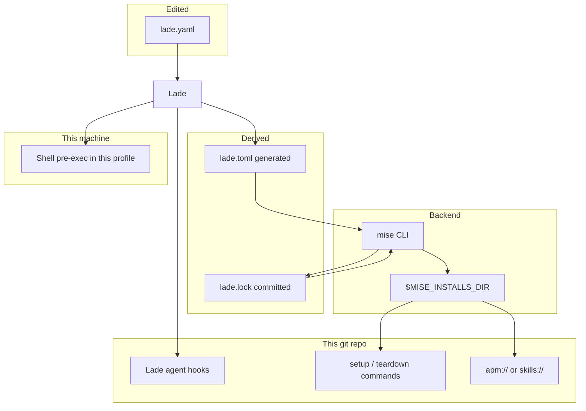
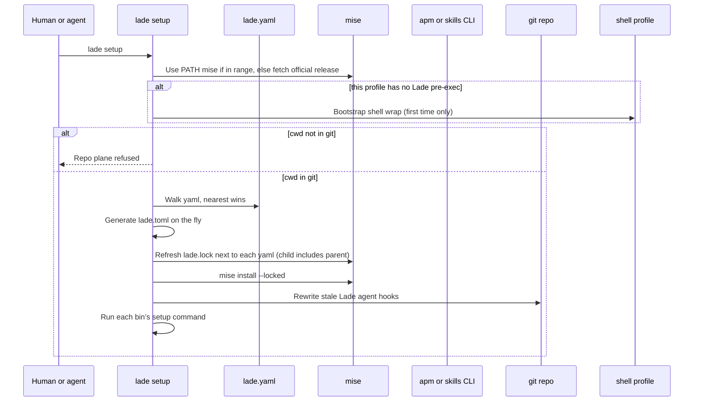
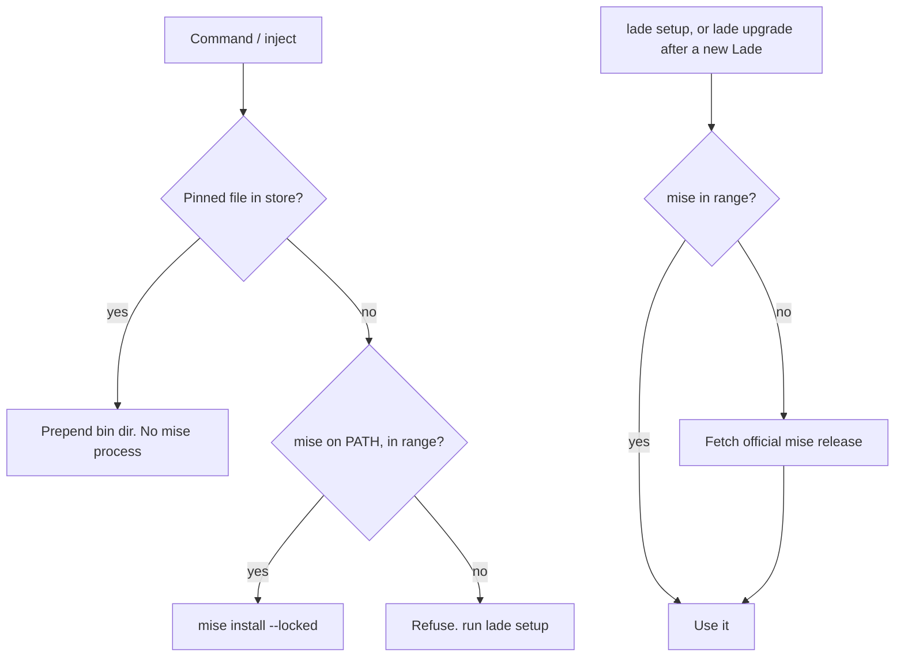
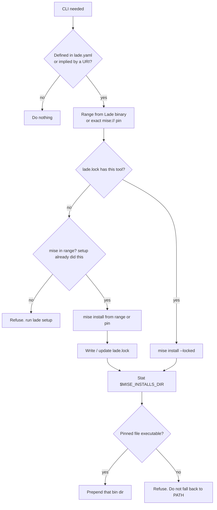
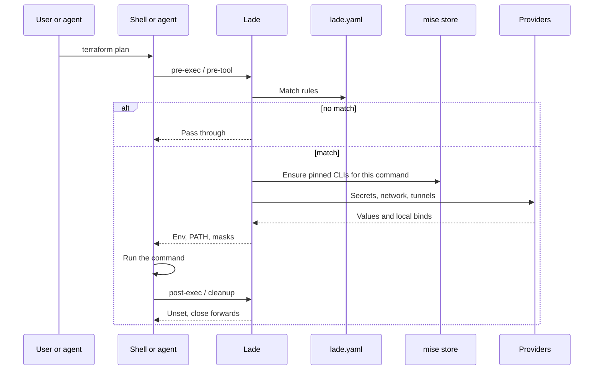
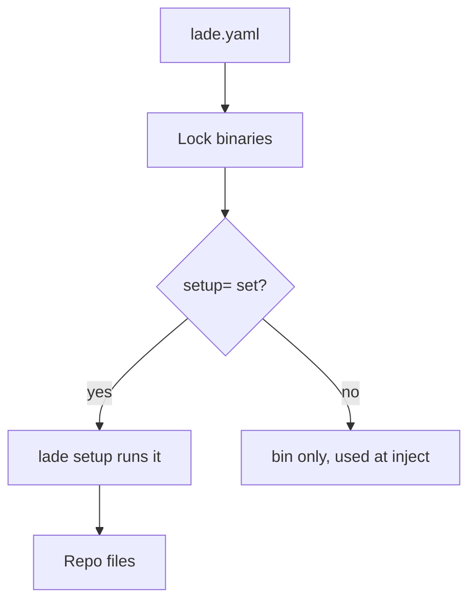
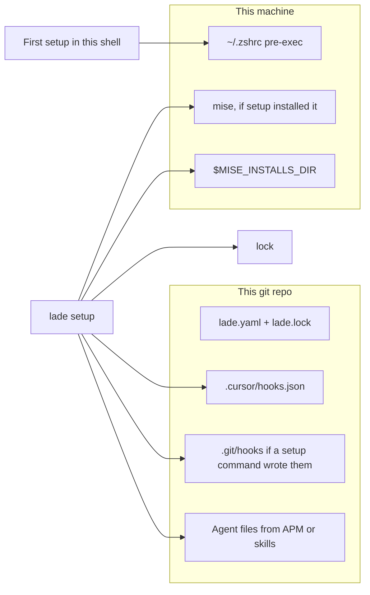
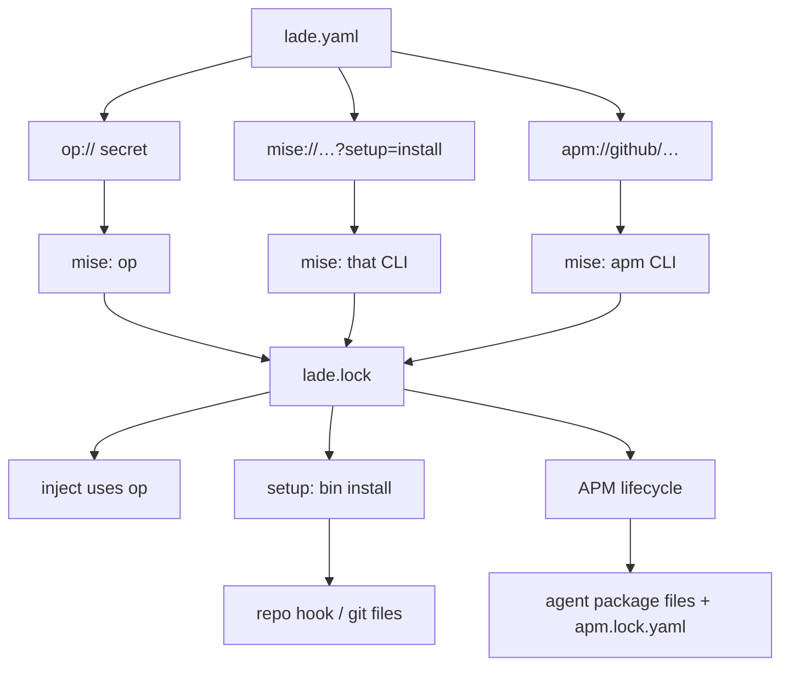

# PRD: Lade as the repo frontend

Desired state. Not a changelog, not the current binary.

`lade.yaml` is the only file humans and agents edit for this layer.
Mise installs and locks binaries. Lade wires this machine’s shell and
this repo’s agent files. Agent packages go through `apm://` (preferred)
or `skills://`. Nothing else is a frontend.

## Core

Lade is the agentic entry for a repo (and a monorepo). Clone, run
`lade setup`, type the command. The right binary is on PATH. The
secret is in the process. The tunnel is up. Then that access is
gone. Human, agent, and **CI build** use the same `lade.yaml`. CI
**runtime** is out: bins and time-limited access do not belong
there, env is someone else’s job.

Not a high-level control plane. Not MCP. Hooks plus the CLI.
Analytics on what ran. Closed loop on the **dev** environment.
Hard work (crypto, secret cache, binary dedup) stays on the
provider. The tool manager (today mise, could be nix) dedups
bins. Do not lead the product story with that name.

**Per-command isolation.** That is the GitHub promise: hydrate
what this command needs, then gone. Env and tunnel tear down.
The mise store and `lade.lock` stay (dedup). Setup-command
side effects stay until teardown commands run.

**Hierarchical `lade.yaml`.** Walk cwd → `$HOME`. Nearest file
wins on a key (child overlays parent). Parent is the default.
Monorepo: `app/lade.yaml` beats the repo root for a command
typed in `app/`. Home is a parent like any other. Making the
walk limit configurable is later, not this scope.

**Speed.** Parse ≤ 2 ms. Hydrate without network < 10 ms.
A command that does not touch the network < 5 ms. Miss on a
bin or a vault may go slower. The hot path stays a stat.

GitHub / crates.io. *Files* (`file://`, `.file`) stay in the
README. Diary is opt-in (`log:`). The third sentence is what
you get when it is on.

> Temporary access to secrets and private networks for one command,
> then gone. Same wrap for humans and agents. See which access was
> used.

Under that:

> Rules live in `lade.yaml`, from this folder up to home. The
> command you typed picks the access. Nothing else sees it.

## Decisions (this pass)

Spoken word is **secret**. `env` is the mechanism and a CLI alias.
Keep today’s **file provider** (`file://…?query=`). `.file` on a
rule stays the optional json/yaml output for that command. Neither
is a fourth family. **Raw** is in the secret family. The wizard
and the box warn: raw is a value you typed, not a vault secret.

First-time shell wrap: after `lade setup` writes the profile,
the current session must reload it (`source ~/.zshrc`,
`source ~/.bashrc`, or open a new terminal). Docs and `lade add`
say so. Other shells still need `lade hook enable --shell`.

Same wrap = same `lade.yaml` match and the same resolve. Not the
same installer. Human, agent, CI build: strictly the same access
for that command.

`lade add` writes the nearest `lade.yaml`, then runs `lade setup`
(repo plane, same as a manual setup). No extra “apply” verb.

Project `mise.toml` is ignored for Lade tools. Lade generates
`lade.toml` on the fly. No version conflict with the project’s
mise file.

Frontend filename: **`lade.yaml`**. Same directory has both
`.yml` and `.yaml`: error (or one-shot migrate onto `.yaml`).

**Required Lade version.** Optional first line is `#: >=0.18.0`.
A YAML comment, so it cannot steal a command regex. A rule for
`#` is a quoted key (`"#"` or `"\\#"`). Missing comment means
any Lade. Every file on the walk is checked. This binary below
the range: refuse, box, run `lade upgrade` or edit the `#:`
line. Manual. No pin command. `lade upgrade` does not load yaml.

`lade.lock` sits next to **each** `lade.yaml`. The child lock
is the resolved child+parent set. Parent-locked tools appear
in the child lock on purpose.

Diary: one machine db, rows stamped with this git root. Opt-in
`log:`. When on, record match **and** no-match, what resolved
(including which **bin**), at write time (audit snapshot).
Winners only, not the losing parent URI. A home rule that
fired in a repo is in that repo’s `lade log`. `lade log prune`
uses the same filter as `lade log`, plus `--global`. Status
`log.events` uses that same filter (this repo, not the whole
disk).

## Problem

A clone today splits across tools that each write their own files,
often under `$HOME`, often unlocked. Agents pick machine scope instead
of the repo. Homebrew CLIs float. Status warns instead of installing.
A second manifest becomes a second source of truth.

## Families

Three families. One short token everywhere (CLI, box, JSON). Spoken
word in the table. Aliases only on the CLI.

| Token | Spoken | Aliases | What |
| --- | --- | --- | --- |
| `secret` | secret | `env` | A value for the command. Vaults, `file://`, `age://`, **raw**. Lands in the process env |
| `tunnel` | tunnel | `net`, `network`, `fwd` | A local forward (`kubectl://`, `tsh://`, `kubefwd://`, `ssh://`) |
| `bin` | binary | `cli`, `tool`, `pkg`, `package`, `apm`, `skill` | Something mise (or APM / skills) installs. `mise://`, `apm://`, `skills://`, or a scheme that implies a CLI |

`pkg` is `bin`. `apm` and `skills` are CLIs. The package ref is
what that CLI installs. Same wizard: search, pick, rule.

DCG, prek, hk are `bin` too, with setup/teardown commands when they
must write repo files.

`network` and `tunnel` are the same family. Every current network
URI opens a forward. One wizard: `tunnel`.

The token and the spoken word are **secret**. `env` is an alias.
Raw is still this family (a value, not a vault).

Mise is not a family. It is the install backend for `bin`.

Other words, keep them:

| Word | Means |
| --- | --- |
| rule | Regex key in `lade.yaml` (`^terraform`, `.`) |
| key | Env or port name on that rule (`TF_VAR_FOO`, `DB_PORT`) |
| scheme | URI prefix (`op`, `kubectl`, `mise`, `apm`, raw) |
| agent | Coding agent (Cursor, Claude, …). Not “harness” |
| scope | `user` vs project. Only on `lade hook` |

```bash
lade add secret
lade add bin
lade add tunnel
lade add env                       # alias → secret
lade add bin aws --rule '^terraform'
lade add bin apm://github/destructure-command-hook --rule '.'
```

## Goals

- One edited file: `lade.yaml` (nearest on the walk)
- One `lade.lock` next to each `lade.yaml` (child includes parent)
- Lade tools ignore project `mise.toml`. Generated `lade.toml` only
- Mise is the backend (process, not vendored). Official release,
  semver range in this Lade. PATH mise in range is accepted.
  Setup and status check it. A Lade release may pin a mise floor
  after a mise bug, without blocking forever
- Every product CLI is that CLI, locked. Range in Lade, override
  in yaml. Setup **and** inject refresh the lock if it is stale.
  Wrong bin version: the command does not run
- `lade setup` is **repo-scoped**. Shell wrap is a one-time
  machine hook (`lade hook`, see below)
- Any `bin` URI may set setup and teardown commands. No allowlist.
  `lade setup` runs setup commands (idempotent when the tool is).
  `lade teardown` (repo) runs teardown commands
- CI: build only. Same yaml. Not runtime

## Non-goals

- Embed or vendor mise (crate or a mise binary inside the Lade artifact)
- Compose with or conflict-check the project’s `mise.toml`
- Adopt a Homebrew **tool** CLI (`op`, `aws`) as the pin. Mise
  on PATH is allowed if it is in range
- An official Lade skill. Repos install *their* packages with `apm://`
- `npx skills@latest` or any unpinned package CLI
- Home-directory agent hooks or global package installs from `lade setup`
- `lade install` / `lade uninstall` as product verbs
- A dedicated DCG / prek / hk product surface (they are `bin` +
  setup/teardown commands)
- Extra restore logic for Vercel `skills-lock.json`. APM is enough
- Lade as a production runtime or a generic MCP host

## Vercel skills, for the record

The skills CLI can install **project-local** (default) or `-g` home.
It writes `skills-lock.json` and has an experimental restore
(`skills experimental_install`). Local paths work (`./my-skill`).

Lade does not grow a second package manager around that. Prefer
`apm://`. APM already installs hooks and skills, pins in
`apm.lock.yaml`, and scans primitives. If a repo uses `skills://`,
Lade locks the `skills` CLI through mise and hands the ref to that
CLI. No extra Lade lock format.

## Roles

| Piece | Role |
| --- | --- |
| `lade.yaml` | Only frontend (nearest file on the walk) |
| Lade CLI | Match, hydrate, lock, observe. Repo `setup` / `teardown` |
| Generated `lade.toml` | Mise adapter. Not edited. On the fly |
| `lade.lock` | Next to that yaml. Child lock includes parent tools |
| Project `mise.toml` | Ignored for Lade tools |
| Mise | Official binary, range or PATH if in range |
| APM / skills | `bin` CLIs. Their own package lock |

## Commands

```bash
lade setup                 # this repo
lade teardown              # this repo
lade hook enable --shell   # this shell’s pre-exec (machine)
lade hook disable --shell
lade hook enable --harness cursor
lade hook disable --harness cursor
lade add
lade remove
```

`setup` / `teardown` are **this git repo**: agent hooks, locks,
setup/teardown commands. They do not write `~/.zshrc` except on
**first bootstrap** (this profile has no Lade pre-exec). After
that, a missing shell wrap is a warning: `lade hook enable --shell`.
Other shells: listed, not written. `on` / `off` pause this shell.

`--scope user` stays on `lade hook` for leftover home **agent**
hooks only. Setup never writes `$HOME` agent files.

The binary arrives with `installer.sh` or `agent-setup.sh`, then
`lade setup` in the repo. CI build runs that repo plane, no
shell wrap.

## add / remove

Interactive writers for `lade.yaml`. Not a second frontend. TTY only
for the wizard. No TTY: flags, or refuse.

`lade add` with no args asks the family first (`secret`, `bin`,
`tunnel`). Then it queries that family, then which rule.
It writes the **nearest** `lade.yaml`. If more than one file
could be meant, ask. Then it runs `lade setup` (this repo).

Interactive is the point. Each family queries through the same
locked CLI Lade would call at inject. Lade does not scrape the web.

- **`bin`:** `mise search`, or APM / skills search when the pick
  is `apm` / `skills`. Same family.
- **`secret`:** scheme first, including **raw** (type the value, no
  CLI). Else that CLI lists what the user can see (`op item list`,
  `vault kv list`, …). Filter in the TTY. Field if needed. Then
  rule and key.
- **`tunnel`:** `kubectl` walks context → namespace → kind → name
  → port. `tsh ls` / `tsh kube ls` for Teleport. Then rule and key.

Not logged in: the wizard says the CLI needs an authenticated
session, points at that product's docs, and stops. It does not
pick the login command or open a browser.

`lade add ghjk` is the `bin` shortcut (`mise search ghjk`). It does
not also search env or tunnels. Family first, or
`lade add bin ghjk` / `lade add secret --query db`.

```bash
lade add secret
lade add tunnel
lade add secret --query db
```

`lade remove` edits the nearest yaml only. Teardown commands run
on `lade teardown` (repo), not on remove. The mise store stays.

Non-interactive:

```bash
lade add bin aws --rule '^terraform'
lade add bin apm://github/destructure-command-hook --rule '.'
lade remove bin aws --rule '^terraform'
```

## Repo setup, one-time shell

Everyday: `git clone && lade setup`. That is **this repo**.

The shell wrap is this machine. It cannot live in the repo. Users
should not think about it after the first day.

1. This profile has no Lade pre-exec (first time in this shell):
   `lade setup` writes it, the box says reload this shell
   (`source ~/.zshrc` or equivalent), then does the repo.
2. Later `lade setup` in any repo: repo only. If this shell has
   no wrap: warning, `lade hook enable --shell`.
3. `lade teardown`: repo only (teardown commands, Lade project
   agent hooks). Shell wrap stays. `lade hook disable --shell`
   removes it.
4. `lade on` / `off`: pause this shell, do not uninstall.

CI (`CI` set): repo plane, no shell wrap. Scratch folder, no git: setup
refuses the repo plane. It may still bootstrap the shell if that
profile has never been wrapped and `CI` is unset.



**This repo.** Locks, agent hooks, setup commands. Git required.

**This shell.** Only if this profile has never been wrapped, or via
`lade hook enable --shell`. Other shells are listed, not written.

Home leftovers are flagged, never stacked. User and project hooks for
the same agent is an error. Setup does not write `$HOME` agent files.

## Setup sequence



Mise sees only the generated `lade.toml`. Project `mise.toml` is
not read for Lade tools. Each `lade.lock` sits next to its yaml.

## Mise: bootstrap, not vendor

Do not vendor. The crate is not a library. Shipping mise inside the
Lade binary would add that whole release to every Lade artifact and
couple the two version trains. Linking it would blow compile time
and size for a process we already isolate.

The accepted mise range lives in the Lade binary, same idea as `op
>= 2.18.0`. That range can move when Lade moves.

**Enforce** (no download): inject on a store miss, and `lade status`.
Wrong or missing mise is a refuse / not-ok. The box says `run lade
setup`.

**Remediate** (may download): `lade setup`. That is the bootstrap.

1. `mise --version` on PATH. In this Lade’s semver range: use it.
2. Missing or too old: fetch the official mise release (flexible
   enough that a mise bug can be unblocked by a Lade release
   bumping the range, not by a hardcoded checksum forever).
3. Mise resolves which binary to run (its store, its PATH rules).
   Lade does not invent a second PATH policy. We generate
   `lade.toml` + `lade.lock` and call mise.

`lade upgrade` upgrades Lade. It is not a second mise product. After
the new binary is in place, it runs the same mise ensure as setup,
because this Lade now owns a possibly newer range. If no managed
binary is in play, it does not fetch mise. `agent-setup.sh` / the
human installer may call that ensure so the first setup is not the
first network hop for mise.

`lade status` repeats the version check. It does not download.

**Inject does not download mise.** It may refresh `lade.lock` and
run `mise install --locked` when the pin is stale or missing. Wrong
version: the command does not run. The hot path is still a store
stat when the lock agrees. Miss and mise is out of range: refuse,
`run lade setup`. No mise **fetch** on the prompt.



## Binary resolution

The Lade binary ships a support range per known CLI
(`op >= 2.18.0`, `vault >= …`, `aws >= …`, `az >= …`,
`gcloud >= …`). That is a range, not a pin. Mise resolves it,
`lade.lock` stores the exact version and checksum.

`lade.yaml` may override:

```yaml
.:
  aws: mise://aqua/awscli@">=2.15.0"
  vault: mise://hashicorp/vault@1.17.0
```

A range in the yaml is valid. An exact `@1.17.0` is valid. Omitted
means Lade’s range. Setup and inject refresh the lock when it is
stale. The lock is what the next command must match.

Lade does not bypass mise to pick a Homebrew `aws` / `op`.
Mise’s resolve is the resolve. The lock is what we asked mise
for. If the store already has it, mise will not download again.



**Full binary.** `op`, `vault`, `aws`, `az`, `gcloud`, `sops`,
`doppler`, `infisical`, `bw`, `kubectl`, and the rest. Lade calls
the locked CLI. It does not embed those SDKs. Login stays the
product’s (`vault login`, `aws sso login`, `az login`, `gcloud
auth login`). Lade orchestrates.

`age://` and `file://` stay in-process. They are not a product CLI.

A CLI that is not in a mise backend cannot be lock-installed. Refuse.

## Command-time resolution

Lade’s own agent hooks wrap the command. Lade does not ship a skill
for that.



`mise://` on a command key is a pin for that argv0.
`apm://` and `skills://` are not resolved here.

## Setup and teardown commands

On any `bin` URI. Same idea for mise pins and `apm://`. No
allowlist. The yaml is the custom surface.

```yaml
dcg: mise://github:Dicklesworthstone/destructive_command_guard@0.6.6?setup=install&teardown=uninstall
prek: mise://aqua/j178/prek@0.2.0?setup=install&teardown=uninstall
```

`lade setup` (repo) runs each `setup` command after the bin is
locked. Prefer idempotent tools. No guarantee. `lade teardown`
(repo) runs each `teardown` command. A binary not in the yaml is
ignored.



## Agent packages

`apm://github/destructure-command-hook` is enough to install hooks
and skills from that package. APM’s lifecycle applies: resolve, scan,
deploy into this repo’s agent dirs, write `apm.lock.yaml`. Teardown
is APM’s uninstall, not a Lade-invented reverse.

Lade does not also run `dcg install` because a package is named dcg.
If the package needs the `dcg` binary on disk, declare that binary
too. If it needs `dcg` to write its own hook files, put
`?setup=install` on the binary.

`skills://` is the same shape if someone prefers the Vercel CLI.
APM stays the default in docs and examples.

## What lands where



`lade teardown` is this repo: teardown commands, Lade project agent
hooks. Shell wrap stays (`lade hook disable --shell`). Home agent
hooks stay (`lade hook disable --scope user --harness cursor`). Mise
and the store stay.

## Status

Nothing is vendored except Lade itself (`age://`, `file://` stay
in-process). `op`, `vault`, `aws`, `az`, `gcloud`, `dcg` live in
`$MISE_INSTALLS_DIR` and `lade.lock`. Status is not “only mise”.

- **Mise:** `lade status` and `lade setup` both check `mise --version`
  against the range shipped in this Lade. Out of range: status is
  not-ok, setup remediates. Shown when any managed CLI exists.
- **Each locked CLI:** store hit + lock agrees. Not `op --version` on
  PATH. Not the old compat warning.
- **Hooks, packages, Lade version:** as today, additive JSON.

`ok` fails if mise is required and out of range, or if a locked CLI
is missing from the store. It does not fail because Homebrew `op` is
old.

## Valid configurations

### Secrets only

```yaml
^terraform:
  TF_VAR_api_key: op://DOMAIN/VAULT/ITEM/FIELD
```

Setup ensures mise, locks `op` from Lade’s range into `lade.lock`.
Inject uses that bin. Same for `awssm://` → `aws`, `azurekv://` →
`az`, `gcpsm://` → `gcloud`, `vault://` → `vault`, unless the yml
sets another range.

### Exact pin plus secret

```yaml
^tofu:
  tofu: mise://aqua/opentofu/opentofu@1.8.2
  TF_VAR_FOO: op://DOMAIN/VAULT/ITEM/FIELD
```

`tofu` is exact. `op` still comes from the range unless also pinned.
Both beat Homebrew and a different version in `mise.toml`.

### Catch-all rust pin

```yaml
.:
  cargo: mise://core/rust@1.96.0
  rustc: mise://core/rust@1.96.0
```

### Network and tunnel

```yaml
^kubectl:
  CLUSTER: kubectl://my-context
```

`kubectl` is a binary, locked like `op`. The URI is the network /
tunnel family at inject time.

### Binary with project write, plus an agent package

```yaml
^terraform:
  TF_VAR_api_key: op://DOMAIN/VAULT/ITEM/FIELD

.:
  dcg: mise://github:Dicklesworthstone/destructive_command_guard@0.6.6?setup=install&teardown=uninstall
  prek: mise://aqua/j178/prek@0.2.0?setup=install&teardown=uninstall
  guard: apm://github/destructure-command-hook
```

`packages` is illustrative. Any value that is `apm://` or `skills://`
is an agent package. APM then owns that install.

After setup in a git repo:

- mise is present and in range
- `lade.lock` lists `op`, `dcg`, `prek` (and the APM CLI if needed)
- Lade agent hooks are in this repo
- `dcg install` and `prek install` ran in the repo
- APM installed the package and wrote its lock

### Project mise.toml already exists

Valid and ignored for Lade tools. Humans can still `mise install`
from that file. Lade never reads it for pins.

### Invalid

```yaml
# agent package at inject time
^ls:
  NOTE: apm://github/destructure-command-hook
```

```yaml
# unpinned package CLI
.:
  packages:
    - npx://skills
```

```yaml
# bare version is not a pin
^jq:
  jq: "1.7.1"
```

Home leftover plus project hooks for the same agent: error until one
plane is removed.

No git: repo setup commands are not applied.

## Dependency picture



## Acceptance

- `lade.yaml` is the only file a human or agent is told to edit
- Optional leading version string is a semver range. Below it,
  refuse. `lade upgrade` still runs. No extra pin command
- `lade setup` is this repo. Shell wrap is first-time or
  `lade hook enable --shell`
- Mise: official release, semver range, PATH ok if in range.
  Status and setup check. Inject does not fetch mise. Inject
  may refresh `lade.lock`. Wrong bin version: command fails
- One `lade.lock` per yaml. Child lock includes parent tools
- Project `mise.toml` is not read for Lade tools
- Homebrew `op` / `aws` is not the pin
- Setup/teardown commands on any bin URI. No allowlist
- Diary opt-in. Resolved snapshot. Winners only. Same filter
  for `lade log` and prune (`--global` to go wider)
- Human, agent, CI **build**: same yaml. CI runtime: out
- Hot path: parse ≤ 2 ms, no-network command < 5 ms
- Teardown (repo) does not delete Lade, mise, or the store
