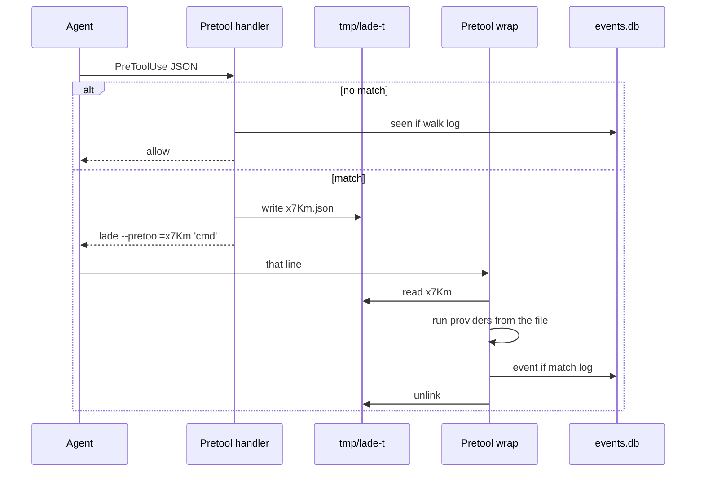
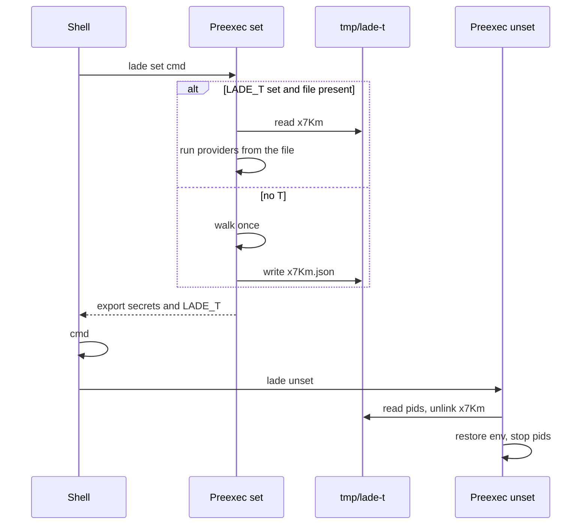

# T protocol

T is a 4-character id (`A-Za-z0-9`). File: `{temp_dir}/lade-t/{id}.json`.
The file is the pre-event: everything needed to run providers. No second
`lade.yml` walk. No rematch. Missing file: walk once, as a cold start.

Regenerate the id if `create_new` fails or if the id is `eval`, `help`,
`hook`, or `user`. Space-form `--pretool echo` stays a command: a 4-char
token after `--pretool` is an id only when that file already exists.
`--pretool=x7Km` always peels.

See also [architecture.md](architecture.md) and [observability.md](observability.md).

## Pass

| Surface | T |
|---|---|
| Pretool wrap | `--pretool` optional value: `lade --pretool=x7Km 'npm test'` |
| Preexec set | writes `{id}.json`, exports `LADE_T=x7Km` |
| Preexec unset / approve | `LADE_T` from the previous set |
| Direct inject, MCP, eval | none |

Env keeps `LADE_T` (preexec pointer), `LADE_RESTORE` (previous env, may
contain secrets), and `LADE_APPROVE` (command + 5 min window). Via,
network pids, and pending disclaimer live on the ticket. Leftover
`LADE_VIA` is ignored.

The child never sees the id or `LADE_T`. Direct inject ignores a leftover
`LADE_T` from a previous `set`. Unset unlinks if `LADE_T` is a valid id.

## Surfaces

| Surface | What runs | Via |
|---|---|---|
| Pretool handler | Agent PreToolUse stdin | `pretool` |
| Pretool wrap | `lade --pretool[=id] <cmd>` (inject) | `pretool` |
| Preexec set | `lade set <cmd>` | `preexec` |
| Preexec unset | `lade unset` | (none) |
| Direct inject | `lade inject` / `lade <cmd>` | `organic` or `unknown` |
| Approve | then inject | same as inject |
| MCP spawn | `lade mcp` | `mcp` |
| MCP verb | `lade hook` (no T) | `mcp` |
| Eval URI | `lade eval <uri>` | `organic` or `unknown` |
| age plugin | `age-plugin-lade` | `organic` or `unknown` |

## Flow

## Paths

Diary `log` on a match is the last explicit `log` on **matching** rules.
No-match `seen` uses the last explicit `log` on the loaded walk.

| Surface | T | Providers | Unlink | Diary |
|---|---|---|---|---|
| Pretool handler, no match | none | no | | `seen` if walk log |
| Pretool handler, match | writes | no | | wrap writes |
| Pretool wrap, id present | read | from file | wrap, after the child | if match log |
| Pretool wrap, no id | none | walk | | if match log, `seen` on no match |
| Preexec set, `LADE_T` | read, keep | from file | unset | if match log |
| Preexec set, no `LADE_T` | write on match | walk | unset | if match log, `seen` on no match |
| Preexec unset | read pids | restore / pids / output files | yes, if `LADE_T` | no |
| Direct inject | none | walk | | if match log, `seen` on no match |
| Approve | read if `pending` | from file, then inject | wrap, after the child | if match log |
| MCP spawn | none | walk | | if match log, `seen` on no match |
| MCP verb | none | no | | `seen` if match log or walk log |

## Disclaimer

T carries disclaimer **texts**. The gate stays in wrap / set
(`resolve_disclaimers`). The handler does not prompt.

The approve code is not the T id. It is
`sha256(command + "\n" + window)[:5]` hex, `window = unix_time / 300`
(5 minutes). Current and previous windows are accepted. The id is
already on `lade --pretool=x7Km`. Using it as `LADE_APPROVE` would let
an agent copy the wrap line and skip the disclaimer.

T is the messenger (command, cwd, disclaimers, work, agent, pids,
pending). `lade approve` reads `LADE_T`, requires `pending: true`,
verifies the code, then injects. A successful set cannot be
re-approved.

## Pre-event

`{temp_dir}/lade-t/{id}.json`. No secret values. Enough to call
providers with no YAML.

| Field | Content |
|---|---|
| `command` | Raw command |
| `cwd` | Directory of the walk |
| `via` | `pretool` or `preexec` |
| `audience` | `human` or `agent` |
| `actor` | Lade user or OS user |
| `log` | Last explicit `log` on the matched rules |
| `disclaimers` | Texts, already collected |
| `secrets` | `{key, source, private, output?, cwd}` user already resolved |
| `network` | `{key, uri}` |
| `matches` | Diary shape: `[{file, rule, bindings: [{key, uri}]}]` |
| `op_sa` | Optional 1Password service-account URI, not the token |
| `agent` | Free-form hook metadata (`harness`, `model`, `session`, …). Absent if empty |
| `network_pids` | Live tunnel pids after preexec acquire. Absent when empty |
| `pending` | `true` when preexec withheld a disclaimer. Absent otherwise |

## Event

Same `matches`. Outcome filled. INSERT if `log`. New uuid v7. T id is
not the row id.

| Field | Content |
|---|---|
| `id` | uuid v7 |
| `ts` | emit time |
| `kind` | `access` / `denied` / `seen` |
| `via` | `pretool` / `preexec` / `mcp` / `organic` / `unknown` |
| `audience` | `human` / `agent` |
| `actor` | same |
| `repo` | `git_stamp(cwd)` |
| `git_commit` | `git_stamp(cwd)` |
| `command` | Scrubbed match/display text |
| `command_truncated` | `command` cut at 1024 scalars |
| `argv` | JSONB object or array, or null |
| `hydrate_ms` | ms, or null |
| `matches` | from the pre-event, or `[]` |
| `agent` | Sparse hook metadata, or null |
